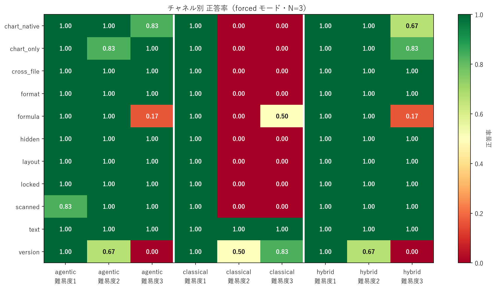
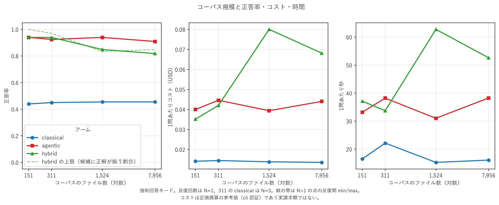
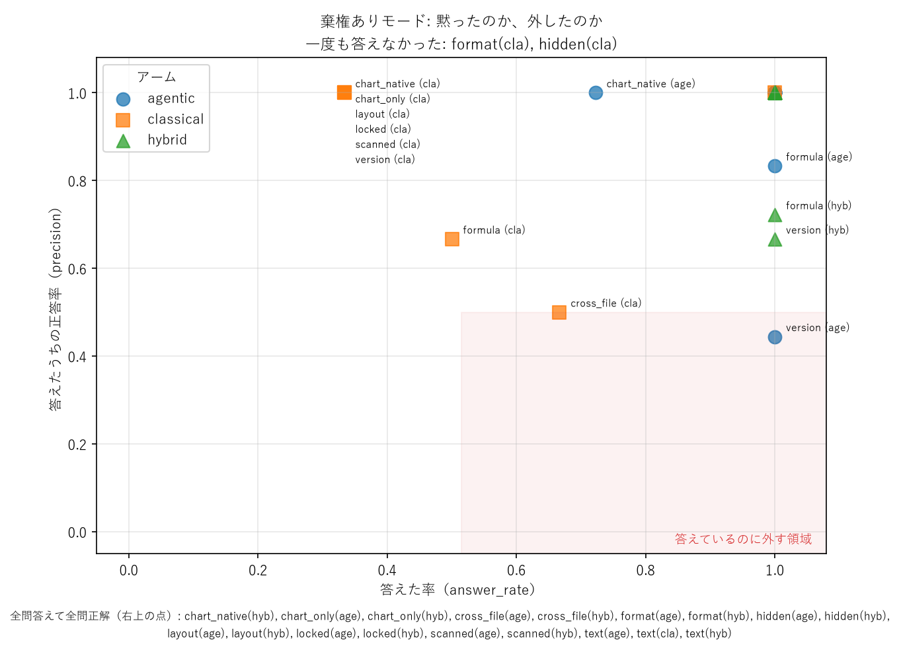
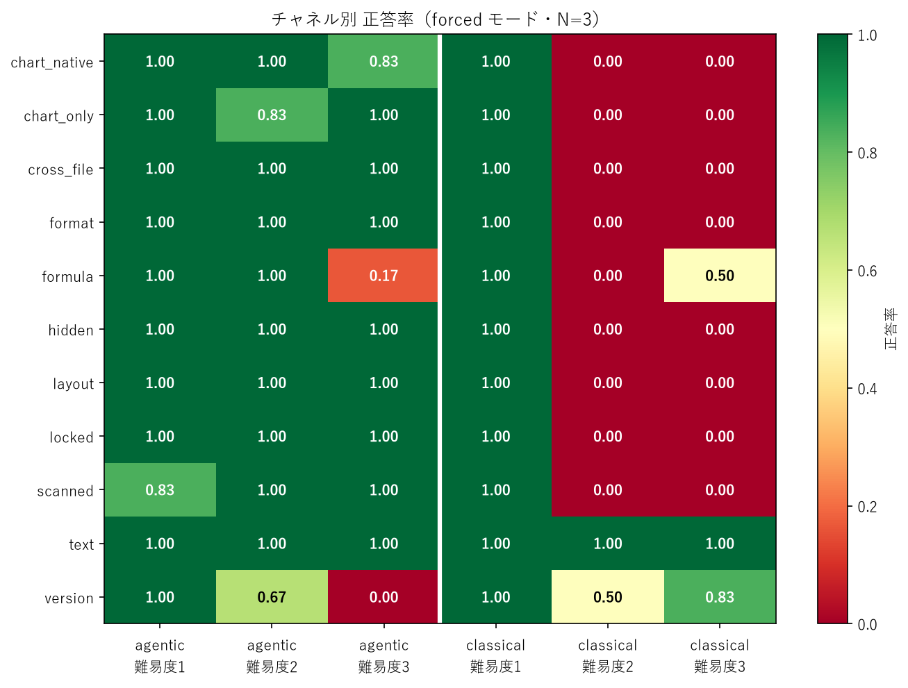

# where-rag-breaks

> 古典的RAG（chunk + embed + top-k）が「どの情報チャネルで壊れるか」を、正解ラベルつきの合成コーパスで測るベンチマーク。
>
> A benchmark that measures **which information channels break classical RAG** (chunk + embed + top-k), using a synthetic corpus with automatically-derived ground truth.

**ステータス: P4（スケーリング）まで完了。11チャネル × 3アーム × 2モードに加え、4 規模（151〜7,956 ファイル）の測定が揃っている。**
**次にやることは [docs/next-steps.md](docs/next-steps.md) に書いてある（P5 実データ検証ほか）。**

**Status: done through P4 (scaling) — eleven channels, three arms, two modes, plus four corpus sizes from 151 to 7,956 files.**
**What comes next is written up in [docs/next-steps.md](docs/next-steps.md) (P5 real-data validation and more).**

---

## 日本語

### これは何か

実務の文書QAでは、答えが**本文テキスト以外のチャネル**に入っていることが多い。セルの塗り色、数式、グラフの中の数値、スキャンPDF、図の空間配置、版の差分、複数ファイルの合計、発表者ノート、パスワード付きファイル。

古典的RAGはこれらを**チャンク化の時点で落とす**。落ちたことに気づく仕組みもない。結果、モデルは与えられたチャンクから自信満々に間違える。

このリポジトリは、その現象を**誰でも再現できる形**で示す。合成コーパスなので正解ラベルが自動で手に入り、罠の種類と難易度を設計できる。

### 測り方

同じコーパス・同じモデルで3つの実装を走らせ、**情報チャネル別**の正答率とコストを比較する。

| アーム | 索引 | 検索 |
|---|---|---|
| **A `classical`** | チャンク + 埋め込み + BM25 | top-k（k をスイープ） |
| **B `agentic`** | カタログ + Markdown ミラー | モデルが `grep` / `ls` / `read` で自分で探す |
| **C `hybrid`** | 両方 | A でファイル候補を絞ってから B |

11の情報チャネル: `text` `format` `formula` `chart_only` `chart_native` `scanned` `layout` `version` `cross_file` `hidden` `locked`

### チャネル設計の共通ルール — 各チャネルに「コントロール段」を置く

全チャネルが**難易度1〜3 の3段**を持ち、難易度は「計算の難しさ」ではなく
**何が抽出不能か**で決めている。

| 段 | 位置づけ |
|---|---|
| **1 コントロール** | 同じ答えが**テキストからも読める**形で置いてある。classical が解けて当然の段 |
| **2 到達不能** | 答えがそのチャネル固有の場所にしかない |
| **3 囮つき** | 答えは到達不能で、かつ**もっともらしい間違った値が読める位置にある** |

**難易度1 を置くのがこの設計の肝。** ここが 1.000 に張り付いていれば、
「罠を積み上げて baseline を潰しただけではない」ことの証拠になる。逆にここが
落ちたら、それは罠が効いたのではなく抽出器か検索が壊れている合図である。

難易度3 の「囮」は `Item.decoys` に生成時から登録してあり、採点は
`decoy_rate`（= **設計どおりの間違え方をした割合**）を出す。
単なる不正解と、罠が狙いどおり効いた不正解は別物として数える。

| チャネル | 答えの所在 | 難易度3 の囮 |
|---|---|---|
| `text` | 本文の段落 | （ベースライン） |
| `format` | セルの塗り色 | 別の行の備考欄に目立つ文字列 |
| `formula` | 数式と参照範囲 | 陳腐化したキャッシュ値 |
| `chart_only` | グラフ画像の中の数値 | 本文に書かれた全社合計 |
| `chart_native` | chart定義の系列名（非表示シート参照） | 別順序の「掲載順」注記 |
| `scanned` | テキスト層のない画像PDF | 送付状に載る前回ロット番号 |
| `layout` | 図形の空間関係 | 五十音順の在席者一覧 |
| `version` | 旧版と新版の実質差分 | **旧版の値そのもの**（難易度2 にも囮がある） |
| `cross_file` | N ファイルにまたがる集計 | 1件取りこぼした古い集計表 |
| `hidden` | pptx の発表者ノート | 本文に載る前回案件の値引き率 |
| `locked` | パスワード付きファイルの中身 | 送付状に載る速報値 |

> ★ **`format` と `layout`、`chart_native` 難易度3 では、正解の文字列自体は
> 抽出テキストに現れる。** 管理番号は表にあるし、氏名は一覧に載る。
> 隠れているのは文字列ではなく「どれがそれか」という対応づけである。
> 「正解文字列が抽出できる＝罠が壊れている」ではない点に注意。

### Arm A の測定結果（11チャネル）


396呼出（66問 × k=8 × 棄権2モード × N=3）、`claude-sonnet-5`、
BM25 + BGE-m3 の RRF 融合、コーパス 311ファイル / 591チャンク。
全文は [`results/p1-seed42-ja-k8/report.md`](results/p1-seed42-ja-k8/report.md)。

**強制回答モード（棄権なし）**

| 段 | 結果 |
|---|---|
| 難易度1（コントロール） | **11チャネルすべてで 1.00** |
| 難易度2（到達不能） | 11チャネル中 **9つで 0.00** |
| 難易度3（囮つき） | 11チャネル中 9つで 0.00（`formula` のみ 0.50） |

**8チャネルがぴったり 0.333（= 6/18）に並ぶ。** これは「コントロール段だけ正解、
罠の段は全滅」という意味である。塗り色・グラフ画像・空間配置・暗号化・
ファイル横断集計は互いにまったく別の機構なのに、同じ形で壊れる。
そして**コントロール段が全部 1.00 である以上、原因は抽出器でも検索でもない。**

反復間のばらつきは全チャネルで **0**（min = max = mean、N=3）。

**気づける損失と、気づけない損失**


棄権を許すと、チャネルは3つの型に分かれる。

| 型 | チャネル | 挙動 |
|---|---|---|
| **気づいて黙る** | `chart_native` `chart_only` `layout` `locked` `scanned` | answer_rate 0.333 / **precision 1.000**。読めないと分かると答えない |
| **問い自体を疑って黙る** | `format` `hidden` | answer_rate **0.000**。設問が「塗り色」など検証できない性質を指すので、コントロール段すら棄権する |
| **気づかず間違える** | `cross_file` `formula` | answer_rate 0.5〜0.67 で、答えた半分が誤り。**足りないことに気づけない** |

危険なのは3番目である。`cross_file` は10ファイルのうち窓に入った数件だけで
合計を出し、それが不足していることに気づかない。

**採点の内訳（開示）**

- LLM judge が exact match を覆した: **0件**（P0 で入れた「〜構内」alias により解消）
- 囮に一致したため judge にかけなかった: **23件**
- 棄権フラグを立てずに本文で「算出不可」と答えた: **20件**。契約どおり誤答として
  採点しており、`penalized` はそのぶん実態より低い
- **検証可能性**: `tool_results` 合計 0、`num_turns != 1` の呼出 0

**★ `version` はこの表から外して読むこと。** この run では 1.00 だが、
それはパスに `current/` と書いてあったため。下記のとおり作り直して再測定した。

### `version` の作り直しと再測定

上の run で `version` は全段 1.00 だった。原因はパスである。Arm A はチャンクに
出所を付けて渡すので、`[policies/current/VR-4879_policy.docx :: 第3条]` と
見えた時点で、中身を比べるまでもなく現行版が分かる。モデルの evidence は
実際すべて `current/` を指していた。

出所の明示をやめれば罠は成立するが、それは evidence を書かせるために必要で
実務でも普通に行うことなので、SPEC §4-1 が禁じる手抜きに当たる。
**罠のほうを直した。**

難易度2 以降は同一フォルダに文書管理番号（`_D6345`）で並べ、現行版かどうかは
**文書冒頭の改訂日**にしかない形にした。連番（`_ed1` / `_ed2`）は使わない
——番号の大小そのものがヒントになるため。改訂日は保証期間の条文とは別の見出しに
置いてあるので、構造を見たチャンク分割では**別チャンクに落ちる**。

再測定（[`results/p1-version-v2-k8/`](results/p1-version-v2-k8/)、36呼出・N=3）:

| 難易度 | 構成 | forced | decoy_rate | abstain_ok の answer_rate |
|---|---|---|---|---|
| 1 コントロール | パスで判別できる | **1.000** | 0.000 | 1.000 |
| 2 | 改訂日でしか判別できない | **0.500** | **0.500** | **0.000** |
| 3 | 同上 + 旧版が検索で上位に来る | 0.833 | 0.000 | **0.000** |

罠として機能するようになった。難易度2 では半数で旧版の値を答えている。
棄権モードでは難易度2・3 とも一切答えないので、これは**気づける損失**である。

> ⚠️ **難易度3（0.833）が難易度2（0.500）を上回っており、段の順序が逆転している。**
> 1段あたり 2問 × 3反復 = 6件しかないので、この順序は現時点のデータでは確定して
> いない。段の難易度順を主張するには設問数を増やす必要がある
> （SPEC §3-2 の最終目標である1チャネル10問なら1段あたり3〜4問）。

> **コーパスの違いについて**: 上の11チャネルの表はコーパス `098d2e5f77e1c9a9`、
> この再測定は `3d28964b9fdb6089` による。差分は `version` のファイルと、
> それに伴って再配分されたディストラクタ12件のみで、他10チャネルの設問ファイルは
> **バイト単位で同一**である（チャネルごとに乱数の名前空間を分けているため）。


### 3アーム比較（P3）



同じコーパス・同じモデル・強制回答モード・N=3。

| アーム | 正答率 | 純スコア（正−誤） | 1問あたりコスト | 1問あたり秒 | ツール呼出 |
|---|---|---|---|---|---|
| **A `classical`** | 0.449 | **−0.076** | $0.014 | 22.2 | 0 |
| **B `agentic`** | **0.919** | +0.843 | $0.047 | 32.5 | 6.6 |
| **C `hybrid`** | **0.919** | +0.838 | **$0.039** | **29.1** | 6.3 |

- **古典的RAGの純スコアは負**（−0.076）。正解より誤答のほうが多い。
  SPEC §1 が出発点として挙げた実測（ベクトル検索ルートの純スコア −11）と同じ符号。
- **agentic と hybrid は正答率が完全に同じ**（0.919）。hybrid のほうが
  **17%安く、10%速い**。
- ただし **H3（コーパスが大きくなるほど hybrid が有利、破綻点が存在する）は
  これだけでは判定できない。** → 次節の P4 で判定した。
- ⚠️ **この表の hybrid は、絞り込みに抜け道があった状態の数字である。** 候補外の
  ミラーや原本にエージェントが届いていた（P4 で発覚。SPEC §14-9）。物理的に絞って
  測り直した 311 ファイルの値は 0.939（N=1）で、結論は変わらない。

### スケーリング（P4）— H3 の判定



同じ 66 問を、埋め草の量だけ変えた 4 規模のコーパスで測った（強制回答・N=1。
311 ファイルの classical のみ P1 の N=3）。破線は、LLM を呼ばずに測った
「hybrid の候補に正解ファイルがすべて入る割合」＝ hybrid の正答率の上限。

| ファイル数 | classical | agentic | hybrid | hybrid の上限 | agentic $/問 | hybrid $/問 |
|---|---|---|---|---|---|---|
| 151 | 0.439 | 0.939 | 0.939 | 1.000 | 0.040 | 0.035 |
| 311 | 0.449 | 0.924 | 0.939 | 0.970 | 0.045 | 0.042 |
| 1,524 | 0.455 | 0.939 | **0.848** | 0.833 | 0.039 | **0.080** |
| 7,956 | 0.455 | 0.909 | **0.818** | 0.848 | 0.044 | **0.068** |

**H3 はこのコーパスでは支持されなかった。破綻点はあるが、壊れるのは hybrid の側だった。**

- **agentic は 7,956 ファイルでも崩れない。** 設問は文書コード（`PRJ-1234` など）を
  含み、エージェントは 66 問すべてで grep から探し始める。コードで引けるファイルは
  規模によらず最大 11 件なので、規模が探索の難しさにならない
- **hybrid は 1,524 ファイルから落ち、正答率は絞り込みの上限に張り付く。**
  7,956 ファイルで落とした 12 問のうち 8 問は、候補に正解ファイルが揃っていなかった
  問題だった。典型は `locked` で、パスワード規則の文書は質問と語彙が似ていないため
  上位 20 件に入らない。**「関係はあるが似ていない文書」を落とす**のが類似度で絞る
  方式の弱点である
- **しかも hybrid の失敗は高くつく。** 両方が正解した問題ではコストも時間も同じで、
  絞り込みによる節約は出ない。差は hybrid が候補に答えの無い問題で上限まで
  探し続けることから来ている（1 問 $0.17・116 秒、agentic は $0.06・49 秒）
- この結論は「設問が一意な識別子を含む」コーパスでのもの。内容の記述でしか文書を
  特定できない設問では H3 が成り立つ余地が残る（未検証。SPEC §14-9）

P4 では本番前後に、比較の公平性を崩す穴を 5 つ見つけて塞いだ（hybrid の絞り込みの
抜け道、付随ファイルの打ち切り方、CLI の自動メモリの注入、エージェントの一時ファイルの
残留、作業ディレクトリのハードリンク）。経緯と既存結果への影響の検査は SPEC §14-9、
破棄した run は [`results/discarded-20260930-leaky-hybrid/`](results/discarded-20260930-leaky-hybrid/README.md)。

### 棄権を許すと何が変わるか（3アーム × 2モード）



| アーム | モード | 正答率 | 純スコア | 答えた率 | precision | コスト | 秒 |
|---|---|---|---|---|---|---|---|
| `classical` | 強制回答 | 0.449 | **−0.076** | 0.975 | 0.461 | $0.014 | 22.2 |
| `classical` | **棄権あり** | 0.333 | **+0.288** | 0.379 | **0.880** | **$0.006** | 13.9 |
| `agentic` | 強制回答 | 0.919 | +0.843 | 0.995 | 0.924 | $0.047 | 32.5 |
| `agentic` | 棄権あり | 0.909 | +0.843 | 0.975 | 0.933 | $0.050 | 53.0 |
| `hybrid` | 強制回答 | 0.919 | +0.838 | 1.000 | 0.919 | $0.039 | 29.1 |
| `hybrid` | 棄権あり | 0.904 | +0.833 | 0.975 | 0.927 | $0.041 | 36.0 |

**古典的RAGにいちばん効くのは「分からない」と言えるようにすることである。**
純スコアが **−0.076 → +0.288** と負から正に反転する。正答率自体は下がる
（0.449 → 0.333）のに、答えたぶんの precision が 0.461 → **0.880** に上がり、
しかも**コストが半分**（$0.014 → $0.006）になる。読めないと分かった時点で
答えるのをやめるので、無駄な生成が減る。

**エージェントには棄権がほぼ無価値である。** 純スコアは 0.843 → 0.843 で
変わらない。答えた率が 0.995 → 0.975 とほとんど動かないからで、
**道具で何かを取得できた以上、常に「見つけた」と思っている**。

上の図はそれがそのまま形に出ている。オレンジ（classical）は左＝黙る側に、
青と緑（agentic / hybrid）は右端＝必ず答える側に張り付く。

**唯一エージェントが負に落ちるのが `version`**（純スコア −0.111、答えた率 1.000、
囮率 0.556）。古い版を掴んでいることに気づかないまま答え切るので、
棄権できる設計でも救われない。`chart_native` では Arm B もちゃんと棄権して
いる（答えた率 0.722 / precision 1.000）ので、**棄権できないのではなく、
古い値のときだけ気づけない**。

> 実務への含意: **古典的RAGを使い続けるなら、まず棄権を実装すること。**
> 精度を上げるより効く。**エージェントに替えるなら、棄権は当てにならない。**
> 古さの検出は別の仕組み（更新日の突き合わせ、キャッシュ値の再計算）で
> やる必要がある。

### Arm B（agentic）との比較 — エージェントは万能ではない



Arm B は**カタログ + Markdown ミラー**を索引とし、検索はモデル自身が
`list_files` / `read_file` / `grep` / `run_python` / `view_image` で行う。
198呼出（66問 × 強制回答 × N=3）。

★ **ミラーは Arm A とまったく同じ抽出器で作っている。** 前処理で優遇すると
「エージェントが自力で見つけた」のか「索引が良かった」のか区別できなくなるため。
Arm B の強みは索引ではなく道具にある。

**到達不能な損失は、エージェントが解決する**

8チャネルで Arm A の 0.00 が Arm B では 1.00 になった。
塗り色は openpyxl で、グラフ画像は `view_image` で、暗号化ファイルは
規則を2文書から組み立ててパスワードを作り `pyzipper` で、
10ファイル横断の合計は全部開いて集計して、それぞれ解いている。

**ところが「古い値が読める」損失では、エージェントのほうが悪い**

| チャネル | 正答率 A→B | 囮を掴んだ率 A→B |
|---|---|---|
| `formula` 難易度3（陳腐化キャッシュ） | 0.50 → **0.17** | 0.50 → **0.67** |
| `version` 難易度3（旧版を指す目次あり） | 0.83 → **0.00** | 0.17 → **0.44** |

理由は挙動を追うと明快である。

- **`formula`**: エージェントは openpyxl で「正しく」ファイルを開き、
  `data_only=True` が返す**キャッシュ値をそのまま信じる**。Arm A は抽出
  テキストにキャッシュ値と数式の両方が並ぶので、ときどき再計算して気づく。
  **ライブラリで正規に読むことが、かえって古い値に権威を与えている。**
- **`version`**: 目次が旧版を指しているので、エージェントは**素直に辿って
  旧版を読む**（6回中6回）。チャンク検索はポインタを辿らないので、
  この失敗をしない。

つまりこうなる。

| 損失の型 | 古典的RAG | エージェント |
|---|---|---|
| **答えに到達できない** | 壊れる | **解決する** |
| **古い答えが読めてしまう** | ときどき気づく | **より確実に騙される** |

「RAG をやめてエージェントにすれば解決する」は、前者については正しく、
**後者については逆**である。

**コスト**

Arm B は1問あたり $0.02〜0.08 / 24〜125秒。Arm A は約 $0.005 / 約23秒。
**4〜16倍のコストと時間**を払って上の差を買っている。

### 一度反証された話（このリポジトリの作り方そのもの）

`formula` チャネルの初版は「合計値をファイルのどこにも書かない」という罠だった。
**Arm A はこれを 10/10 で突破した。** SPEC §2 が定める反証条件そのものである。

原因は Arm A の手抜きではなかった。モデルは数式を読んで意味を理解し、数量×単価を
12行ぶん計算し、別シートの税率を掛けて正解していた。全問をソースファイルから
独立に再計算して照合済みで、採点バグでもない。

**集計結果だけを隠しても、入力が読める形で残っていれば現代のモデルは再計算する。**
かといって抽出器から数式を落とせば H2 は「成立」するが、それは SPEC §4-1 が禁じる
「抽出器に意図的な穴」であり、禁止されている勝ち方である。

そこで難易度の軸を「計算の複雑さ」から「**何が抽出不能か**」へ組み替えた。

| 難易度 | 罠の機構 |
|---|---|
| 1 | 初版のまま。**コントロールとして意図的に残している**（罠を積んだだけではないことを示すため） |
| 2 | 明細を 240〜320 行にし、入力が top-k の窓に入らないようにする |
| 3 | サマリの数式セルに旧版から計算した**陳腐化したキャッシュ値**を注入する |

経緯は [PR #1 のコメント](https://github.com/nabeofchanKo/where-rag-breaks/pull/1#issuecomment-5826732933)
に測定値つきで残してある。**反証されたら仕様を直す。結果に合わせて評価を曲げない。**

### 現時点でわかっていること（検索プローブ・LLM 未使用）

LLM を呼ぶ前に、**検索側だけ**を切り出して測れる。課金ゼロで完全に決定的なので、
チャネル設計が効いているかをここで先に確認する。

`--seed 42 --files 120 --questions 12`（日本語コーパス、120ファイル、960チャンク、
BM25 + BGE-m3 の RRF 融合）:

| チャネル | 難易度 | k | file_recall | source_coverage | answer_literal | decoy_literal |
|---|---|---|---|---|---|---|
| `text` | 1–3 | 4〜32 | 1.000 | 0.21–0.56 | **1.000** | 0.000 |
| `formula` | 1 (control) | 4〜32 | 1.000 | 0.667 | 0.000 | 0.000 |
| `formula` | 2 (窓超え) | 4 → 32 | 1.000 | **0.136 → 0.374** | 0.000 | 0.000 |
| `formula` | 3 (陳腐化) | 4〜32 | 1.000 | 0.667 | 0.000 | **1.000** |

- `file_recall` … 上位 k に答えのあるファイルが入った割合
- `source_coverage` … 対象ファイルのチャンクのうち窓に入った割合
- `answer_literal` … 上位 k の本文に正解文字列がそのまま現れた割合
- `decoy_literal` … 囮（陳腐化した値）が窓に入った割合

読み方:

- **どのチャネルも検索は失敗していない。** `file_recall` は全条件で 1.000。正しい
  ファイルは k=4 で確実に引けている。
- **難易度2 は窓が足りない。** 対象ファイルは 20〜24 チャンクあるのに、k=32 まで
  上げても 37% しか載らない。明細全体は原理的に見えない。
- **難易度3 は囮だけが見えている。** 正解は 0%、陳腐化した値は 100% 窓に入る。
  値を読んだだけのパイプラインは、もっともらしく整合した古い数字を掴む。

> ⚠️ **この数字を過大に読まないこと。** `answer_literal` が 0 でも、モデルが
> 計算で導ける可能性は残る（実際、難易度1 はそれで突破された）。これは
> 「答えがそのままの形では存在しない」ことの証拠であって、「答えられない」ことの
> 証明ではない。実際の正答率は Arm A を走らせて測る。

再現:

```bash
uv run python -m gen --seed 42 --files 120 --questions 12 --out corpus/
uv run python -m eval.retrieval_probe --corpus corpus/ --k 4,8,16,32
```

### 公平性のためのルール

このベンチマークの価値は**公平な比較**にある。設計上の約束:

- **Arm A を steel-man する** — hybrid retrieval（BM25 + dense）、構造を見たチャンク分割、チャネルごとの最良 k で評価。手を抜いた baseline は叩かない
- **設問ごとの特別扱いを禁止** — どのアームも設問IDを見てはいけない
- **答えの漏洩を自動検査** — ファイル名・カタログ・プロンプトに答えが出ていないか `eval/leak_check.py` で検査
- **N=3 回実行** — 1発取りの数字を結論にしない（平均と min/max を併記）
- **アーム間でモデル・温度を揃える**

詳細は [SPEC.md](SPEC.md) を参照。

### セットアップ

前提: [uv](https://docs.astral.sh/uv/) と Python 3.12。

```bash
git clone https://github.com/nabeofchanKo/where-rag-breaks.git
cd where-rag-breaks
uv sync --system-certs
```

> **`--system-certs` について**: アンチウイルスが TLS を傍受する環境（企業PCなど）では、これが無いと `uv sync` が失敗する。傍受されていない環境では付けても害はない。

LLM を呼ぶ手順（`eval/run.py`）だけ認証が要る。コーパス生成と決定性テストは**認証不要**で動く。

```bash
cp .env.example .env   # 必要に応じて値を埋める
```

### 使い方

```bash
# コーパスを生成する（既定は日本語コーパス。--locale en で英語）
uv run python -m gen --seed 42 --files 20 --out corpus/

# 答えがファイル名やカタログに漏れていないか検査する
uv run python -m eval.leak_check --corpus corpus/

# 決定性テスト（同 seed で2回生成してバイト一致するか）
uv run pytest

# 検索側だけを測る（LLM 未使用・課金ゼロ）
uv run python -m eval.retrieval_probe --corpus corpus/ --k 4,8,16,32

# アームを走らせる（LLM を呼ぶ。認証が要る）
uv run python -m eval.run --corpus corpus/ --arms classical --k 4,8,16
uv run python -m eval.score --run results/<run_id>
uv run python -m eval.report --run results/<run_id>
```

**認証について**: 既定は `WRB_AUTH=cli` で、`claude` CLI のログイン認証（契約プランの枠）を
使う。API の従量課金は発生しない。`.env` に `ANTHROPIC_API_KEY` が置いてあっても、
cli モードでは**環境から明示的に外す**（置いたままだと SDK がそちらを優先して
静かに従量課金へ切り替わるため）。API を使いたい場合は `WRB_AUTH=api` を指定する。

Windows でこのリポジトリを動かすときに踏んだ罠は
[docs/environment-notes.md](docs/environment-notes.md) にまとめてある。

### コーパスの言語

既定は**日本語**（`--locale ja`）。`--locale en` で英語コーパスも生成できる。

**ファイル名・フォルダ名は常に ASCII** にしている。Windows のファイルシステムは日本語名を NFD 正規化するため、Python の NFC リテラルで `os.path.join` すると `exists() == False` になるという既知の罠がある。中身だけを日本語にすることで、この罠を踏まずに日本語資料を扱える。

### ライセンス

MIT

---

## English

### What this is

In real-world document QA, the answer often lives in a channel **other than the body text**: cell fill colors, spreadsheet formulas, numbers inside chart images, scanned PDFs, spatial arrangement in diagrams, diffs between revisions, sums across many files, presenter notes, password-protected files.

Classical RAG drops all of these **at chunking time**, with no mechanism to notice the loss. The model then answers confidently and wrongly from the chunks it was given.

This repository demonstrates that failure in a **reproducible** form. Because the corpus is synthetic, ground truth comes for free, and the traps can be designed by type and difficulty.

### How it measures

Three implementations run over the same corpus with the same model. Accuracy and cost are reported **per information channel**.

| Arm | Index | Retrieval |
|---|---|---|
| **A `classical`** | chunks + embeddings + BM25 | top-k (k is swept) |
| **B `agentic`** | catalog + markdown mirror | the model searches with `grep` / `ls` / `read` |
| **C `hybrid`** | both | A narrows the file candidates, then B |

Eleven channels: `text` `format` `formula` `chart_only` `chart_native` `scanned` `layout` `version` `cross_file` `hidden` `locked`

### One rule across every channel: each has a control tier

Every channel has **three tiers**, graded not by how hard the arithmetic is but by
**what cannot be extracted**.

| Tier | What it is |
|---|---|
| **1 control** | the same answer is also readable as plain text. Classical RAG is expected to get this |
| **2 unreachable** | the answer exists only in that channel's medium |
| **3 decoyed** | the answer is unreachable *and* a plausible wrong value is readable instead |

**Tier 1 is the load-bearing part of this design.** As long as it stays pinned at
1.000, the benchmark has evidence that it did not simply stack traps until the
baseline lost. If tier 1 ever drops, that is a signal the extractor or the retriever
is broken, not that a trap worked.

Tier 3 decoys are registered in `Item.decoys` at generation time, and scoring reports
`decoy_rate` — **the share of answers that were wrong in the specific way the trap
predicted**. Being wrong and being wrong on cue are counted separately.

| Channel | Where the answer lives | Tier 3 decoy |
|---|---|---|
| `text` | a body paragraph | (baseline) |
| `format` | a cell's fill colour | a salient note on a different row |
| `formula` | a formula and its range | a stale cached value |
| `chart_only` | a number inside a chart image | a company-wide total in the body text |
| `chart_native` | chart series names over a hidden sheet | a differently-ordered listing note |
| `scanned` | an image-only PDF | the previous lot number on the cover note |
| `layout` | spatial arrangement in a diagram | an alphabetical occupant roster |
| `version` | the substantive diff between editions | **the old edition's value** (tier 2 is decoyed too) |
| `cross_file` | a sum across N files | a roll-up that missed one case |
| `hidden` | a pptx presenter note | the previous deal's discount in the body |
| `locked` | inside a password-protected file | a preliminary figure on the cover note |

> ★ **In `format`, `layout` and `chart_native` tier 3, the answer string itself does
> appear in the extracted text.** The record numbers are in the table; the names are in
> the roster. What is hidden is not the string but which one it is. "The answer is
> extractable" therefore does not mean the trap failed.

### Arm A results (eleven channels)


396 calls (66 questions x k=8 x 2 abstention modes x N=3), `claude-sonnet-5`,
BM25 + BGE-m3 fused with RRF, over a 311-file / 591-chunk corpus. Full write-up in
[`results/p1-seed42-ja-k8/report.md`](results/p1-seed42-ja-k8/report.md).

**Forced mode (abstention not permitted)**

| Tier | Result |
|---|---|
| 1 control | **1.00 on all eleven channels** |
| 2 unreachable | **0.00 on nine of eleven** |
| 3 decoyed | 0.00 on nine of eleven (`formula` alone at 0.50) |

**Eight channels land on exactly 0.333, which is 6/18**: the control tier and
nothing else. Fill colour, chart images, spatial arrangement, encryption and
cross-file aggregation are entirely unrelated mechanisms that fail in the same
shape — and with every control tier at 1.00, neither the extractor nor the
retriever can be the cause.

Variance across repeats is **zero** on every channel (min = max = mean, N=3).

**Detectable loss versus undetectable loss**


Allowing abstention splits the channels into three kinds.

| Kind | Channels | Behaviour |
|---|---|---|
| **Notices and declines** | `chart_native` `chart_only` `layout` `locked` `scanned` | answer_rate 0.333, **precision 1.000**. It knows when it cannot see |
| **Distrusts the question itself** | `format` `hidden` | answer_rate **0.000**. The question names a property the model cannot verify, so it declines even the control tier |
| **Does not notice** | `cross_file` `formula` | answers 50–67% of the time and half of those are wrong |

The third kind is the dangerous one. `cross_file` sums whichever of the ten files
made it into the window and never registers that the rest are missing.

**Scoring disclosure**

- LLM judge overrode exact match **0 times** (the "premises of X" alias added after
  P0 removed the only disagreement there was)
- **23 answers** matched a decoy and skipped the judge
- **20 answers** refused in prose while leaving `abstained` false; scored as wrong per
  the output contract, so `penalized` is lower than reality by that much
- **Verifiability**: total `tool_results` 0, calls with `num_turns != 1` 0

**★ Read `version` out of this table.** It scores 1.00 here only because the path
said `current/`. It was rebuilt and re-measured separately, below.

### Rebuilding and re-measuring `version`

`version` scored 1.00 at every tier in the run above, because of the path. Arm A
labels each chunk with its origin, so `[policies/current/VR-4879_policy.docx ::
Article 3]` reveals which edition is current before any content is compared. Every
cited evidence string pointed at `current/`.

Dropping provenance would "fix" it, but provenance is what lets the arm cite
evidence at all and is ordinary practice, so removing it is the deliberate hole
SPEC section 4-1 rules out. **The trap was changed instead.**

Tiers 2 and 3 now place both editions in one directory under document control
numbers (`_D6345`), and which one is current is recoverable only from the revision
date inside the document. Deliberately not `_ed1`/`_ed2` — the ordering in a
sequence number is itself the answer. The revision date sits under its own heading,
so structure-aware chunking puts it in a **different chunk** from the clause being
asked about.

Re-measurement ([`results/p1-version-v2-k8/`](results/p1-version-v2-k8/), 36 calls, N=3):

| Tier | Layout | forced | decoy_rate | abstain_ok answer_rate |
|---|---|---|---|---|
| 1 control | path reveals the edition | **1.000** | 0.000 | 1.000 |
| 2 | only the revision date distinguishes them | **0.500** | **0.500** | **0.000** |
| 3 | as above, old edition ranks higher | 0.833 | 0.000 | **0.000** |

The trap now bites: at tier 2 half the answers are the superseded value. Under
abstention it answers nothing at tiers 2 and 3, so this is a **detectable** loss.

> ⚠️ **Tier 3 (0.833) scores above tier 2 (0.500), inverting the intended ordering.**
> Each tier rests on 2 questions x 3 repeats = 6 observations, so the ordering is not
> established at this sample size. Claiming a difficulty order would need more
> questions per channel (SPEC section 3-2's eventual target of 10 gives 3–4 per tier).

> **On the two corpora**: the eleven-channel table above comes from corpus
> `098d2e5f77e1c9a9`, this re-measurement from `3d28964b9fdb6089`. They differ only
> in the `version` files plus 12 redistributed distractors; the question files of the
> other ten channels are **byte-identical**, because each channel draws from its own
> RNG namespace.


### Three-arm comparison (P3)


Same corpus, same model, forced mode, N=3.

| Arm | accuracy | penalized | cost/question | s/question | tool calls |
|---|---|---|---|---|---|
| **A `classical`** | 0.449 | **−0.076** | $0.014 | 22.2 | 0 |
| **B `agentic`** | **0.919** | +0.843 | $0.047 | 32.5 | 6.6 |
| **C `hybrid`** | **0.919** | +0.838 | **$0.039** | **29.1** | 6.3 |

- **Classical RAG's penalized score is negative** (−0.076): more wrong answers than
  right ones, the same sign as the −11 measurement SPEC section 1 starts from.
- **Agentic and hybrid tie exactly on accuracy** (0.919), with hybrid **17% cheaper
  and 10% faster**.
- **H3 (hybrid pulls ahead as the corpus grows; a break-even point exists) cannot be
  decided from this.** See P4 below.
- ⚠️ **The hybrid row above was measured with a leaky narrowing step.** The agent could
  still reach mirrors and originals outside its candidates (found in P4, SPEC 14-9).
  Re-measured with physical narrowing at 311 files it scores 0.939 (N=1); the
  conclusion does not change.

### Scaling (P4): deciding H3


The same 66 questions, on four corpora that differ only in how much filler they hold
(forced mode, N=1; classical at 311 files is P1's N=3). The dashed line is measured
without an LLM: the share of questions whose answer files all make it into hybrid's
candidates, which caps hybrid's accuracy.

| files | classical | agentic | hybrid | hybrid ceiling | agentic $/q | hybrid $/q |
|---|---|---|---|---|---|---|
| 151 | 0.439 | 0.939 | 0.939 | 1.000 | 0.040 | 0.035 |
| 311 | 0.449 | 0.924 | 0.939 | 0.970 | 0.045 | 0.042 |
| 1,524 | 0.455 | 0.939 | **0.848** | 0.833 | 0.039 | **0.080** |
| 7,956 | 0.455 | 0.909 | **0.818** | 0.848 | 0.044 | **0.068** |

**H3 is not supported on this corpus. There is a break point, but it is hybrid that breaks.**

- **Agentic holds up at 7,956 files.** Every question carries a document code
  (`PRJ-1234` and so on) and the agent opens all 66 questions with a grep. At most 11
  files match a code at any size, so size does not make the search harder
- **Hybrid drops from 1,524 files on, and its accuracy tracks its narrowing ceiling.**
  Of the 12 questions it missed at 7,956 files, 8 never had all their answer files among
  the candidates. The typical case is `locked`: the document holding the password rule
  shares little vocabulary with the question, so it never makes the top 20. Dropping
  **documents that are related but not similar** is the weak spot of narrowing by
  similarity
- **And hybrid's failures are expensive.** On questions both arms got right, cost and
  time are the same, so narrowing saves nothing. The gap comes from hybrid searching to
  its turn limit when the answer is not among its candidates ($0.17 and 116 s per
  question, against $0.06 and 49 s for agentic)
- This holds for a corpus whose questions carry a unique identifier. For questions that
  can only locate a document by describing its content, H3 may still hold (untested,
  SPEC 14-9)

Around the P4 runs we found and closed five gaps that would have skewed the comparison
(a leak in hybrid's narrowing, how companion files were capped, the CLI injecting the
user's auto memory, agents' scratch files persisting in the corpus, and hard links in the
workspace). SPEC 14-9 has the details and the check of earlier results; discarded runs
are in [`results/discarded-20260930-leaky-hybrid/`](results/discarded-20260930-leaky-hybrid/README.md).

### What abstention changes (three arms, two modes)


| Arm | Mode | accuracy | penalized | answer rate | precision | cost | s |
|---|---|---|---|---|---|---|---|
| `classical` | forced | 0.449 | **−0.076** | 0.975 | 0.461 | $0.014 | 22.2 |
| `classical` | **abstain** | 0.333 | **+0.288** | 0.379 | **0.880** | **$0.006** | 13.9 |
| `agentic` | forced | 0.919 | +0.843 | 0.995 | 0.924 | $0.047 | 32.5 |
| `agentic` | abstain | 0.909 | +0.843 | 0.975 | 0.933 | $0.050 | 53.0 |
| `hybrid` | forced | 0.919 | +0.838 | 1.000 | 0.919 | $0.039 | 29.1 |
| `hybrid` | abstain | 0.904 | +0.833 | 0.975 | 0.927 | $0.041 | 36.0 |

**The single most valuable thing you can give classical RAG is permission to say
"I don't know."** The penalized score flips from **−0.076 to +0.288**. Accuracy
itself falls (0.449 → 0.333), but precision among answered rises from 0.461 to
**0.880** and the cost **halves** ($0.014 → $0.006), because it stops generating
once it knows it cannot see.

**Abstention buys the agent almost nothing.** Its penalized score is 0.843 either
way, because its answer rate barely moves (0.995 → 0.975): having retrieved
*something* with its tools, it always believes it found the answer.

The figure shows exactly that. Orange (classical) hugs the left — declining —
while blue and green (agentic, hybrid) sit against the right edge, always answering.

**The one place the agent goes negative is `version`** (penalized −0.111, answer
rate 1.000, decoy rate 0.556). It never notices it is holding a superseded edition,
so being allowed to abstain does not save it. On `chart_native` it does abstain
properly (answer rate 0.722, precision 1.000) — so it is not that it *cannot*
decline, only that staleness is invisible to it.

> Practical reading: **if you are keeping classical RAG, implement abstention
> first** — it beats accuracy work. **If you are switching to an agent, do not rely
> on abstention.** Detecting staleness needs a separate mechanism (comparing
> revision dates, recomputing cached values).

### Comparing Arm B (agentic) — the agent is not uniformly better


Arm B indexes with a **catalog plus a markdown mirror** and does its own searching
through `list_files` / `read_file` / `grep` / `run_python` / `view_image`.
198 calls (66 questions, forced mode, N=3).

★ **The mirror is built with exactly the same extractor as Arm A.** Privileging
ingestion would make it impossible to tell whether the agent found something or
the preprocessor handed it over. Arm B's strength is meant to be its tools.

**Unreachable answers: the agent solves them**

Eight channels go from 0.00 under Arm A to 1.00 under Arm B. Fill colours through
openpyxl, chart images through `view_image`, encrypted archives by assembling the
password rule from two documents and opening the zip with `pyzipper`, ten-file sums
by opening all ten and adding them up.

**But where a stale answer is readable, the agent does worse**

| Channel | accuracy A→B | decoy rate A→B |
|---|---|---|
| `formula` tier 3 (stale cache) | 0.50 → **0.17** | 0.50 → **0.67** |
| `version` tier 3 (index points at the old edition) | 0.83 → **0.00** | 0.17 → **0.44** |

Following the traces makes the reason plain.

- **`formula`**: the agent opens the workbook "properly" with openpyxl and trusts
  the cached value `data_only=True` hands back. Arm A sees the cached value and the
  formula side by side in extracted text and sometimes recomputes.
  **Reading the file correctly is what lends the stale number its authority.**
- **`version`**: the index points at the old edition, so the agent follows it and
  reads the superseded document — six times out of six. Chunk retrieval never
  follows a pointer, so it cannot fail this way.

Which gives:

| Kind of loss | Classical RAG | Agent |
|---|---|---|
| **Cannot reach the answer** | breaks | **solves it** |
| **A stale answer is readable** | sometimes notices | **more reliably fooled** |

"Drop RAG and use an agent" is right about the first row and **backwards about the
second**.

**Cost**

Arm B runs $0.02–0.08 and 24–125 s per question, against roughly $0.005 and 23 s for
Arm A — **4 to 16 times the cost and time** for the difference above.

### The part that got falsified (and why that matters)

The first version of the `formula` channel hid only one thing: the total was
written nowhere in the file. **Arm A scored 10/10 against it** — precisely the
falsification condition SPEC section 2 lays out.

The cause was not a lazy Arm A. The model read the formulas, multiplied quantity by
unit price across twelve rows, and pulled the tax rate from another sheet. Every
answer was re-derived independently from the source workbooks, so it was not a
scoring bug either.

**Hiding the aggregate is not enough when the inputs remain readable; a modern model
just recomputes.** Stripping formulas out of the extractor would "restore" H2, but
that is the deliberate hole SPEC section 4-1 forbids — a win that does not count.

So the difficulty axis moved from "how hard is the arithmetic" to "what cannot be
extracted at all":

| Tier | Trap mechanism |
|---|---|
| 1 | unchanged, **kept on purpose as a control** — evidence that traps were not simply stacked until the baseline lost |
| 2 | the detail sheet grows to 240–320 rows, so the inputs cannot fit in the top-k window |
| 3 | **stale cached values** computed from a previous revision are injected into the summary's formula cells |

The full write-up with measurements lives in
[the PR #1 comment](https://github.com/nabeofchanKo/where-rag-breaks/pull/1#issuecomment-5826732933).
**When the design is falsified, fix the design — never bend the evaluation to fit the result.**

### What we know so far (retrieval probe, no LLM)

The retrieval side can be measured on its own, before any LLM is involved. It costs
nothing and is fully deterministic, which makes it the right place to check whether
the channel design actually bites.

`--seed 42 --files 120 --questions 12` (Japanese corpus, 120 files, 960 chunks,
BM25 + BGE-m3 fused with RRF):

| Channel | Tier | k | file_recall | source_coverage | answer_literal | decoy_literal |
|---|---|---|---|---|---|---|
| `text` | 1–3 | 4–32 | 1.000 | 0.21–0.56 | **1.000** | 0.000 |
| `formula` | 1 (control) | 4–32 | 1.000 | 0.667 | 0.000 | 0.000 |
| `formula` | 2 (window) | 4 → 32 | 1.000 | **0.136 → 0.374** | 0.000 | 0.000 |
| `formula` | 3 (stale) | 4–32 | 1.000 | 0.667 | 0.000 | **1.000** |

- `file_recall` — a chunk from a file holding the answer made it into the top k
- `source_coverage` — share of the target file's chunks that fit in the window
- `answer_literal` — the answer string appears verbatim in the retrieved text
- `decoy_literal` — the decoy (the stale value) is inside the window

How to read it:

- **Retrieval never fails.** `file_recall` is 1.000 everywhere; the right file is
  found reliably at k=4.
- **Tier 2 is a window problem.** The target file is 20–24 chunks; even at k=32 only
  37% of it fits. The full line-item table is unreachable by construction.
- **Tier 3 shows only the decoy.** The answer is never visible, the stale value always
  is. A pipeline that reads values picks up a plausible, internally consistent, wrong
  number.

> ⚠️ **Do not over-read this.** `answer_literal` of 0 still leaves room for the model
> to *derive* the answer — tier 1 was beaten exactly that way. This is evidence the
> answer does not exist in literal form, not proof that it cannot be answered. Actual
> accuracy requires running Arm A.

Reproduce:

```bash
uv run python -m gen --seed 42 --files 120 --questions 12 --out corpus/
uv run python -m eval.retrieval_probe --corpus corpus/ --k 4,8,16,32
```

### Fairness rules

The value of this benchmark rests entirely on the comparison being fair:

- **Steel-man Arm A** — hybrid retrieval (BM25 + dense), structure-aware chunking, evaluated at the best `k` per channel. Beating up a strawman baseline proves nothing
- **No per-question special-casing** — no arm may look at the question ID
- **Automated leak checking** — `eval/leak_check.py` verifies the answer never appears in a filename, the catalog, or a prompt
- **N=3 runs** — never conclude from a single run (mean plus min/max are both reported)
- **Identical model and temperature across arms**

See [SPEC.md](SPEC.md) (Japanese) for the full design.

### Setup

Requires [uv](https://docs.astral.sh/uv/) and Python 3.12.

```bash
git clone https://github.com/nabeofchanKo/where-rag-breaks.git
cd where-rag-breaks
uv sync --system-certs
```

> **On `--system-certs`**: on machines where antivirus software intercepts TLS, `uv sync` fails without it. It is harmless elsewhere.

Only the LLM-invoking step (`eval/run.py`) needs credentials. Corpus generation and the determinism tests run with **no credentials at all**.

### Usage

```bash
# Generate the corpus (Japanese by default; --locale en for English)
uv run python -m gen --seed 42 --files 20 --out corpus/

# Check that no answer leaked into a filename or the catalog
uv run python -m eval.leak_check --corpus corpus/

# Determinism test: generate twice with the same seed, assert byte equality
uv run pytest

# Measure retrieval alone (no LLM, no cost)
uv run python -m eval.retrieval_probe --corpus corpus/ --k 4,8,16,32

# Run the arms (calls the LLM; needs credentials)
uv run python -m eval.run --corpus corpus/ --arms classical --k 4,8,16
uv run python -m eval.score --run results/<run_id>
uv run python -m eval.report --run results/<run_id>
```

**On authentication**: the default is `WRB_AUTH=cli`, which uses the `claude` CLI login
(your subscription allowance) and incurs no metered API billing. In cli mode an
`ANTHROPIC_API_KEY` sitting in `.env` is **actively removed from the environment**,
because leaving it there makes the SDK prefer it and quietly switch to metered
billing. Set `WRB_AUTH=api` when you do want the API.

The Windows-specific traps hit while building this are written up in
[docs/environment-notes.md](docs/environment-notes.md).

### Corpus language

The default corpus is **Japanese** (`--locale ja`); `--locale en` produces an English one.

**Filenames and folder names are always ASCII.** Windows normalizes Japanese filenames to NFD, so an `os.path.join` built from Python's NFC literals yields `exists() == False`. Keeping only the *content* Japanese avoids that trap entirely.

### License

MIT
