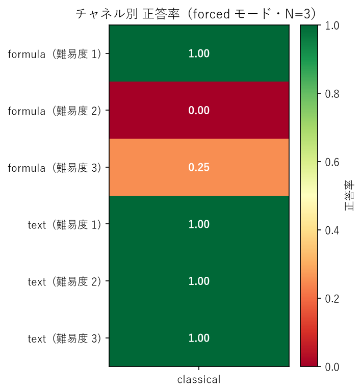
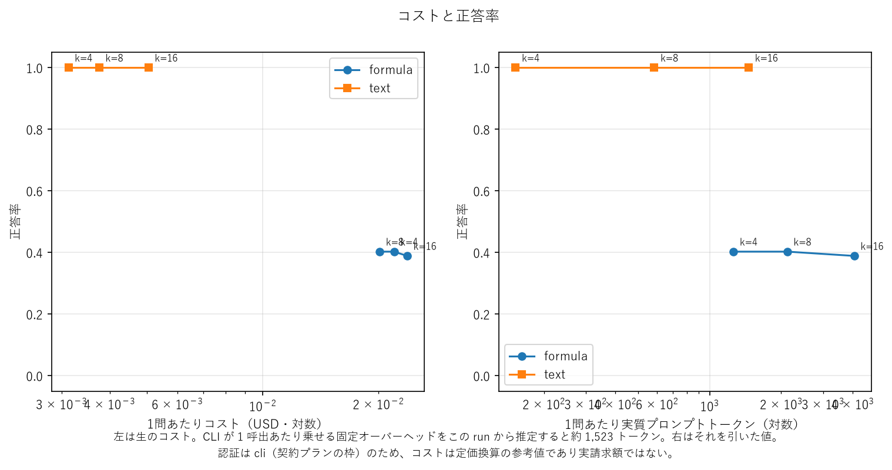

# 実行レポート — `p0-seed42-ja`

## 実行条件

- モデル: `claude-sonnet-5`  認証: `cli`
- コーパス: seed `42` / locale `ja` / generator_version `1`
- アーム: classical
- k: [4, 8, 16]  モード: ['forced', 'abstain_ok']  反復: 3
- CLI の固定オーバーヘッド（この run から推定）: **1,523 トークン/呼出**

### 索引の構成

```json
{
  "classical": {
    "n_chunks": 960,
    "chunk_chars": 1200,
    "overlap_chars": 200,
    "embedding_model": "BAAI/bge-m3",
    "retrieval": "bm25 + dense (RRF)",
    "reranker": null
  }
}
```

### 密閉性の検証（SPEC §4-2）

- ツールが結果を返した回数: **0**（Arm A は 0 でなければ無効）
- 往復が 1 回で終わらなかった呼出: **0**

### 採点

- LLM judge: `claude-sonnet-5`
- judge が exact match を覆した件数: **14**
- 囮に一致したため judge にかけなかった件数: **42**

採点基準に対する事後変更は [`docs/scoring-changes.md`](../../docs/scoring-changes.md) を参照。

## 図




## チャネル × 難易度（= 罠の機構）

| arm       | mode       | channel   |   difficulty |   total |   correct |   incorrect |   answered |   accuracy |   penalized |   answer_rate |   precision |   decoy_rate |
|:----------|:-----------|:----------|-------------:|--------:|----------:|------------:|-----------:|-----------:|------------:|--------------:|------------:|-------------:|
| classical | abstain_ok | formula   |            1 |  36.000 |    36.000 |       0.000 |     36.000 |      1.000 |       1.000 |         1.000 |       1.000 |      nan     |
| classical | abstain_ok | formula   |            2 |  36.000 |     0.000 |       0.000 |      0.000 |      0.000 |       0.000 |         0.000 |       0.000 |      nan     |
| classical | abstain_ok | formula   |            3 |  36.000 |     5.000 |      20.000 |     25.000 |      0.139 |      -0.417 |         0.694 |       0.200 |        0.556 |
| classical | abstain_ok | text      |            1 |  54.000 |    54.000 |       0.000 |     54.000 |      1.000 |       1.000 |         1.000 |       1.000 |      nan     |
| classical | abstain_ok | text      |            2 |  36.000 |    36.000 |       0.000 |     36.000 |      1.000 |       1.000 |         1.000 |       1.000 |      nan     |
| classical | abstain_ok | text      |            3 |  18.000 |    18.000 |       0.000 |     18.000 |      1.000 |       1.000 |         1.000 |       1.000 |      nan     |
| classical | forced     | formula   |            1 |  36.000 |    36.000 |       0.000 |     36.000 |      1.000 |       1.000 |         1.000 |       1.000 |      nan     |
| classical | forced     | formula   |            2 |  36.000 |     0.000 |      35.000 |     35.000 |      0.000 |      -0.972 |         0.972 |       0.000 |      nan     |
| classical | forced     | formula   |            3 |  36.000 |     9.000 |      27.000 |     36.000 |      0.250 |      -0.500 |         1.000 |       0.250 |        0.611 |
| classical | forced     | text      |            1 |  54.000 |    54.000 |       0.000 |     54.000 |      1.000 |       1.000 |         1.000 |       1.000 |      nan     |
| classical | forced     | text      |            2 |  36.000 |    36.000 |       0.000 |     36.000 |      1.000 |       1.000 |         1.000 |       1.000 |      nan     |
| classical | forced     | text      |            3 |  18.000 |    18.000 |       0.000 |     18.000 |      1.000 |       1.000 |         1.000 |       1.000 |      nan     |

`decoy_rate` は囮（陳腐化したキャッシュ値など）をそのまま答えた割合。
囮のある設問だけが母数で、NaN は囮のない段。

## チャネルごとの最良 k（SPEC §4-1）

| arm       | mode       | channel   |   k |   total |   correct |   incorrect |   answered |   accuracy |   penalized |   answer_rate |   precision |   decoy_rate |
|:----------|:-----------|:----------|----:|--------:|----------:|------------:|-----------:|-----------:|------------:|--------------:|------------:|-------------:|
| classical | abstain_ok | formula   |   8 |  36.000 |    15.000 |       8.000 |     23.000 |      0.417 |       0.194 |         0.639 |       0.652 |        0.667 |
| classical | abstain_ok | text      |   4 |  36.000 |    36.000 |       0.000 |     36.000 |      1.000 |       1.000 |         1.000 |       1.000 |      nan     |
| classical | forced     | formula   |   4 |  36.000 |    16.000 |      19.000 |     35.000 |      0.444 |      -0.083 |         0.972 |       0.457 |        0.333 |
| classical | forced     | text      |   4 |  36.000 |    36.000 |       0.000 |     36.000 |      1.000 |       1.000 |         1.000 |       1.000 |      nan     |

## 反復間のばらつき（SPEC §5-4）

| arm       | mode       | channel   |   accuracy_mean |   accuracy_min |   accuracy_max |   n_repeats |
|:----------|:-----------|:----------|----------------:|---------------:|---------------:|------------:|
| classical | abstain_ok | formula   |           0.380 |          0.361 |          0.389 |           3 |
| classical | abstain_ok | text      |           1.000 |          1.000 |          1.000 |           3 |
| classical | forced     | formula   |           0.417 |          0.417 |          0.417 |           3 |
| classical | forced     | text      |           1.000 |          1.000 |          1.000 |           3 |

