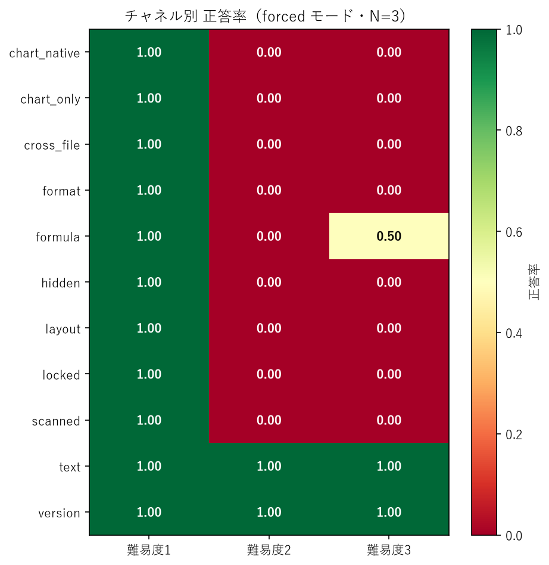
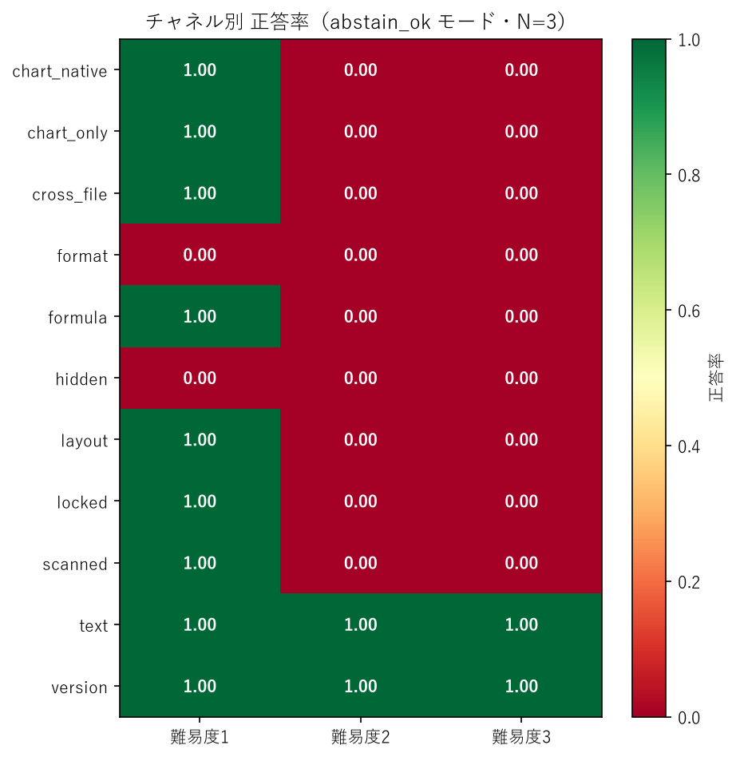
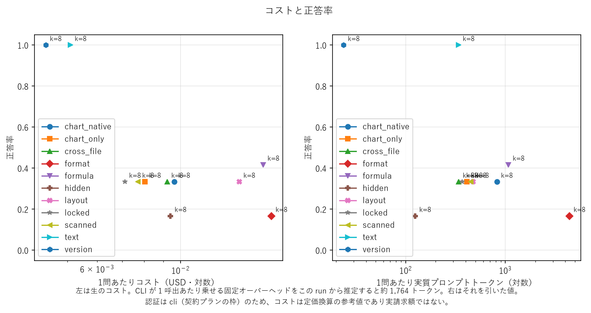

# 実行レポート — `p1-seed42-ja-k8`

## 実行条件

- モデル: `claude-sonnet-5`  認証: `cli`
- コーパス: seed `42` / locale `ja` / generator_version `2`
- アーム: classical
- k: [8]  モード: ['forced', 'abstain_ok']  反復: 3
- CLI の固定オーバーヘッド（この run から推定）: **1,764 トークン/呼出**

### 索引の構成

```json
{
  "classical": {
    "n_chunks": 591,
    "chunk_chars": 1200,
    "overlap_chars": 200,
    "embedding_model": "BAAI/bge-m3",
    "retrieval": "bm25 + dense (RRF)",
    "reranker": null
  }
}
```

### 密閉性の検証（SPEC §4-2）

- ツールが結果を返した回数: **0**（Arm A は 0 でなければ無効）
- 往復が 1 回で終わらなかった呼出: **0**

### 採点

- LLM judge: `claude-sonnet-5`
- judge が exact match を覆した件数: **0**
- 囮に一致したため judge にかけなかった件数: **23**

採点基準に対する事後変更は [`docs/scoring-changes.md`](../../docs/scoring-changes.md) を参照。

## 図





## チャネル × 難易度（= 罠の機構）

| arm       | mode       | channel      |   difficulty |   total |   correct |   incorrect |   answered |   accuracy |   penalized |   answer_rate |   precision |   decoy_rate |
|:----------|:-----------|:-------------|-------------:|--------:|----------:|------------:|-----------:|-----------:|------------:|--------------:|------------:|-------------:|
| classical | abstain_ok | chart_native |            1 |   6.000 |     6.000 |       0.000 |      6.000 |      1.000 |       1.000 |         1.000 |       1.000 |      nan     |
| classical | abstain_ok | chart_native |            2 |   6.000 |     0.000 |       0.000 |      0.000 |      0.000 |       0.000 |         0.000 |       0.000 |      nan     |
| classical | abstain_ok | chart_native |            3 |   6.000 |     0.000 |       0.000 |      0.000 |      0.000 |       0.000 |         0.000 |       0.000 |        0.000 |
| classical | abstain_ok | chart_only   |            1 |   6.000 |     6.000 |       0.000 |      6.000 |      1.000 |       1.000 |         1.000 |       1.000 |      nan     |
| classical | abstain_ok | chart_only   |            2 |   6.000 |     0.000 |       0.000 |      0.000 |      0.000 |       0.000 |         0.000 |       0.000 |      nan     |
| classical | abstain_ok | chart_only   |            3 |   6.000 |     0.000 |       0.000 |      0.000 |      0.000 |       0.000 |         0.000 |       0.000 |        0.000 |
| classical | abstain_ok | cross_file   |            1 |   6.000 |     6.000 |       0.000 |      6.000 |      1.000 |       1.000 |         1.000 |       1.000 |      nan     |
| classical | abstain_ok | cross_file   |            2 |   6.000 |     0.000 |       0.000 |      0.000 |      0.000 |       0.000 |         0.000 |       0.000 |      nan     |
| classical | abstain_ok | cross_file   |            3 |   6.000 |     0.000 |       6.000 |      6.000 |      0.000 |      -1.000 |         1.000 |       0.000 |        0.000 |
| classical | abstain_ok | format       |            1 |   6.000 |     0.000 |       0.000 |      0.000 |      0.000 |       0.000 |         0.000 |       0.000 |      nan     |
| classical | abstain_ok | format       |            2 |   6.000 |     0.000 |       0.000 |      0.000 |      0.000 |       0.000 |         0.000 |       0.000 |      nan     |
| classical | abstain_ok | format       |            3 |   6.000 |     0.000 |       0.000 |      0.000 |      0.000 |       0.000 |         0.000 |       0.000 |        0.000 |
| classical | abstain_ok | formula      |            1 |   6.000 |     6.000 |       0.000 |      6.000 |      1.000 |       1.000 |         1.000 |       1.000 |      nan     |
| classical | abstain_ok | formula      |            2 |   6.000 |     0.000 |       0.000 |      0.000 |      0.000 |       0.000 |         0.000 |       0.000 |      nan     |
| classical | abstain_ok | formula      |            3 |   6.000 |     0.000 |       3.000 |      3.000 |      0.000 |      -0.500 |         0.500 |       0.000 |        0.500 |
| classical | abstain_ok | hidden       |            1 |   6.000 |     0.000 |       0.000 |      0.000 |      0.000 |       0.000 |         0.000 |       0.000 |      nan     |
| classical | abstain_ok | hidden       |            2 |   6.000 |     0.000 |       0.000 |      0.000 |      0.000 |       0.000 |         0.000 |       0.000 |      nan     |
| classical | abstain_ok | hidden       |            3 |   6.000 |     0.000 |       0.000 |      0.000 |      0.000 |       0.000 |         0.000 |       0.000 |        0.000 |
| classical | abstain_ok | layout       |            1 |   6.000 |     6.000 |       0.000 |      6.000 |      1.000 |       1.000 |         1.000 |       1.000 |      nan     |
| classical | abstain_ok | layout       |            2 |   6.000 |     0.000 |       0.000 |      0.000 |      0.000 |       0.000 |         0.000 |       0.000 |      nan     |
| classical | abstain_ok | layout       |            3 |   6.000 |     0.000 |       0.000 |      0.000 |      0.000 |       0.000 |         0.000 |       0.000 |        0.000 |
| classical | abstain_ok | locked       |            1 |   6.000 |     6.000 |       0.000 |      6.000 |      1.000 |       1.000 |         1.000 |       1.000 |      nan     |
| classical | abstain_ok | locked       |            2 |   6.000 |     0.000 |       0.000 |      0.000 |      0.000 |       0.000 |         0.000 |       0.000 |      nan     |
| classical | abstain_ok | locked       |            3 |   6.000 |     0.000 |       0.000 |      0.000 |      0.000 |       0.000 |         0.000 |       0.000 |        0.000 |
| classical | abstain_ok | scanned      |            1 |   6.000 |     6.000 |       0.000 |      6.000 |      1.000 |       1.000 |         1.000 |       1.000 |      nan     |
| classical | abstain_ok | scanned      |            2 |   6.000 |     0.000 |       0.000 |      0.000 |      0.000 |       0.000 |         0.000 |       0.000 |      nan     |
| classical | abstain_ok | scanned      |            3 |   6.000 |     0.000 |       0.000 |      0.000 |      0.000 |       0.000 |         0.000 |       0.000 |        0.000 |
| classical | abstain_ok | text         |            1 |   9.000 |     9.000 |       0.000 |      9.000 |      1.000 |       1.000 |         1.000 |       1.000 |      nan     |
| classical | abstain_ok | text         |            2 |   6.000 |     6.000 |       0.000 |      6.000 |      1.000 |       1.000 |         1.000 |       1.000 |      nan     |
| classical | abstain_ok | text         |            3 |   3.000 |     3.000 |       0.000 |      3.000 |      1.000 |       1.000 |         1.000 |       1.000 |      nan     |
| classical | abstain_ok | version      |            1 |   6.000 |     6.000 |       0.000 |      6.000 |      1.000 |       1.000 |         1.000 |       1.000 |      nan     |
| classical | abstain_ok | version      |            2 |   6.000 |     6.000 |       0.000 |      6.000 |      1.000 |       1.000 |         1.000 |       1.000 |        0.000 |
| classical | abstain_ok | version      |            3 |   6.000 |     6.000 |       0.000 |      6.000 |      1.000 |       1.000 |         1.000 |       1.000 |        0.000 |
| classical | forced     | chart_native |            1 |   6.000 |     6.000 |       0.000 |      6.000 |      1.000 |       1.000 |         1.000 |       1.000 |      nan     |
| classical | forced     | chart_native |            2 |   6.000 |     0.000 |       6.000 |      6.000 |      0.000 |      -1.000 |         1.000 |       0.000 |      nan     |
| classical | forced     | chart_native |            3 |   6.000 |     0.000 |       6.000 |      6.000 |      0.000 |      -1.000 |         1.000 |       0.000 |        0.167 |
| classical | forced     | chart_only   |            1 |   6.000 |     6.000 |       0.000 |      6.000 |      1.000 |       1.000 |         1.000 |       1.000 |      nan     |
| classical | forced     | chart_only   |            2 |   6.000 |     0.000 |       6.000 |      6.000 |      0.000 |      -1.000 |         1.000 |       0.000 |      nan     |
| classical | forced     | chart_only   |            3 |   6.000 |     0.000 |       6.000 |      6.000 |      0.000 |      -1.000 |         1.000 |       0.000 |        0.000 |
| classical | forced     | cross_file   |            1 |   6.000 |     6.000 |       0.000 |      6.000 |      1.000 |       1.000 |         1.000 |       1.000 |      nan     |
| classical | forced     | cross_file   |            2 |   6.000 |     0.000 |       6.000 |      6.000 |      0.000 |      -1.000 |         1.000 |       0.000 |      nan     |
| classical | forced     | cross_file   |            3 |   6.000 |     0.000 |       6.000 |      6.000 |      0.000 |      -1.000 |         1.000 |       0.000 |        0.000 |
| classical | forced     | format       |            1 |   6.000 |     6.000 |       0.000 |      6.000 |      1.000 |       1.000 |         1.000 |       1.000 |      nan     |
| classical | forced     | format       |            2 |   6.000 |     0.000 |       6.000 |      6.000 |      0.000 |      -1.000 |         1.000 |       0.000 |      nan     |
| classical | forced     | format       |            3 |   6.000 |     0.000 |       6.000 |      6.000 |      0.000 |      -1.000 |         1.000 |       0.000 |        1.000 |
| classical | forced     | formula      |            1 |   6.000 |     6.000 |       0.000 |      6.000 |      1.000 |       1.000 |         1.000 |       1.000 |      nan     |
| classical | forced     | formula      |            2 |   6.000 |     0.000 |       6.000 |      6.000 |      0.000 |      -1.000 |         1.000 |       0.000 |      nan     |
| classical | forced     | formula      |            3 |   6.000 |     3.000 |       3.000 |      6.000 |      0.500 |       0.000 |         1.000 |       0.500 |        0.500 |
| classical | forced     | hidden       |            1 |   6.000 |     6.000 |       0.000 |      6.000 |      1.000 |       1.000 |         1.000 |       1.000 |      nan     |
| classical | forced     | hidden       |            2 |   6.000 |     0.000 |       5.000 |      5.000 |      0.000 |      -0.833 |         0.833 |       0.000 |      nan     |
| classical | forced     | hidden       |            3 |   6.000 |     0.000 |       6.000 |      6.000 |      0.000 |      -1.000 |         1.000 |       0.000 |        0.667 |
| classical | forced     | layout       |            1 |   6.000 |     6.000 |       0.000 |      6.000 |      1.000 |       1.000 |         1.000 |       1.000 |      nan     |
| classical | forced     | layout       |            2 |   6.000 |     0.000 |       5.000 |      5.000 |      0.000 |      -0.833 |         0.833 |       0.000 |      nan     |
| classical | forced     | layout       |            3 |   6.000 |     0.000 |       6.000 |      6.000 |      0.000 |      -1.000 |         1.000 |       0.000 |        0.500 |
| classical | forced     | locked       |            1 |   6.000 |     6.000 |       0.000 |      6.000 |      1.000 |       1.000 |         1.000 |       1.000 |      nan     |
| classical | forced     | locked       |            2 |   6.000 |     0.000 |       5.000 |      5.000 |      0.000 |      -0.833 |         0.833 |       0.000 |      nan     |
| classical | forced     | locked       |            3 |   6.000 |     0.000 |       6.000 |      6.000 |      0.000 |      -1.000 |         1.000 |       0.000 |        0.000 |
| classical | forced     | scanned      |            1 |   6.000 |     6.000 |       0.000 |      6.000 |      1.000 |       1.000 |         1.000 |       1.000 |      nan     |
| classical | forced     | scanned      |            2 |   6.000 |     0.000 |       5.000 |      5.000 |      0.000 |      -0.833 |         0.833 |       0.000 |      nan     |
| classical | forced     | scanned      |            3 |   6.000 |     0.000 |       6.000 |      6.000 |      0.000 |      -1.000 |         1.000 |       0.000 |        0.500 |
| classical | forced     | text         |            1 |   9.000 |     9.000 |       0.000 |      9.000 |      1.000 |       1.000 |         1.000 |       1.000 |      nan     |
| classical | forced     | text         |            2 |   6.000 |     6.000 |       0.000 |      6.000 |      1.000 |       1.000 |         1.000 |       1.000 |      nan     |
| classical | forced     | text         |            3 |   3.000 |     3.000 |       0.000 |      3.000 |      1.000 |       1.000 |         1.000 |       1.000 |      nan     |
| classical | forced     | version      |            1 |   6.000 |     6.000 |       0.000 |      6.000 |      1.000 |       1.000 |         1.000 |       1.000 |      nan     |
| classical | forced     | version      |            2 |   6.000 |     6.000 |       0.000 |      6.000 |      1.000 |       1.000 |         1.000 |       1.000 |        0.000 |
| classical | forced     | version      |            3 |   6.000 |     6.000 |       0.000 |      6.000 |      1.000 |       1.000 |         1.000 |       1.000 |        0.000 |

`decoy_rate` は囮（陳腐化したキャッシュ値など）をそのまま答えた割合。
囮のある設問だけが母数で、NaN は囮のない段。

## チャネルごとの最良 k（SPEC §4-1）

| arm       | mode       | channel      |   k |   total |   correct |   incorrect |   answered |   accuracy |   penalized |   answer_rate |   precision |   decoy_rate |
|:----------|:-----------|:-------------|----:|--------:|----------:|------------:|-----------:|-----------:|------------:|--------------:|------------:|-------------:|
| classical | abstain_ok | chart_native |   8 |  18.000 |     6.000 |       0.000 |      6.000 |      0.333 |       0.333 |         0.333 |       1.000 |        0.000 |
| classical | abstain_ok | chart_only   |   8 |  18.000 |     6.000 |       0.000 |      6.000 |      0.333 |       0.333 |         0.333 |       1.000 |        0.000 |
| classical | abstain_ok | cross_file   |   8 |  18.000 |     6.000 |       6.000 |     12.000 |      0.333 |       0.000 |         0.667 |       0.500 |        0.000 |
| classical | abstain_ok | format       |   8 |  18.000 |     0.000 |       0.000 |      0.000 |      0.000 |       0.000 |         0.000 |       0.000 |        0.000 |
| classical | abstain_ok | formula      |   8 |  18.000 |     6.000 |       3.000 |      9.000 |      0.333 |       0.167 |         0.500 |       0.667 |        0.500 |
| classical | abstain_ok | hidden       |   8 |  18.000 |     0.000 |       0.000 |      0.000 |      0.000 |       0.000 |         0.000 |       0.000 |        0.000 |
| classical | abstain_ok | layout       |   8 |  18.000 |     6.000 |       0.000 |      6.000 |      0.333 |       0.333 |         0.333 |       1.000 |        0.000 |
| classical | abstain_ok | locked       |   8 |  18.000 |     6.000 |       0.000 |      6.000 |      0.333 |       0.333 |         0.333 |       1.000 |        0.000 |
| classical | abstain_ok | scanned      |   8 |  18.000 |     6.000 |       0.000 |      6.000 |      0.333 |       0.333 |         0.333 |       1.000 |        0.000 |
| classical | abstain_ok | text         |   8 |  18.000 |    18.000 |       0.000 |     18.000 |      1.000 |       1.000 |         1.000 |       1.000 |      nan     |
| classical | abstain_ok | version      |   8 |  18.000 |    18.000 |       0.000 |     18.000 |      1.000 |       1.000 |         1.000 |       1.000 |        0.000 |
| classical | forced     | chart_native |   8 |  18.000 |     6.000 |      12.000 |     18.000 |      0.333 |      -0.333 |         1.000 |       0.333 |        0.167 |
| classical | forced     | chart_only   |   8 |  18.000 |     6.000 |      12.000 |     18.000 |      0.333 |      -0.333 |         1.000 |       0.333 |        0.000 |
| classical | forced     | cross_file   |   8 |  18.000 |     6.000 |      12.000 |     18.000 |      0.333 |      -0.333 |         1.000 |       0.333 |        0.000 |
| classical | forced     | format       |   8 |  18.000 |     6.000 |      12.000 |     18.000 |      0.333 |      -0.333 |         1.000 |       0.333 |        1.000 |
| classical | forced     | formula      |   8 |  18.000 |     9.000 |       9.000 |     18.000 |      0.500 |       0.000 |         1.000 |       0.500 |        0.500 |
| classical | forced     | hidden       |   8 |  18.000 |     6.000 |      11.000 |     17.000 |      0.333 |      -0.278 |         0.944 |       0.353 |        0.667 |
| classical | forced     | layout       |   8 |  18.000 |     6.000 |      11.000 |     17.000 |      0.333 |      -0.278 |         0.944 |       0.353 |        0.500 |
| classical | forced     | locked       |   8 |  18.000 |     6.000 |      11.000 |     17.000 |      0.333 |      -0.278 |         0.944 |       0.353 |        0.000 |
| classical | forced     | scanned      |   8 |  18.000 |     6.000 |      11.000 |     17.000 |      0.333 |      -0.278 |         0.944 |       0.353 |        0.500 |
| classical | forced     | text         |   8 |  18.000 |    18.000 |       0.000 |     18.000 |      1.000 |       1.000 |         1.000 |       1.000 |      nan     |
| classical | forced     | version      |   8 |  18.000 |    18.000 |       0.000 |     18.000 |      1.000 |       1.000 |         1.000 |       1.000 |        0.000 |

## 反復間のばらつき（SPEC §5-4）

| arm       | mode       | channel      |   accuracy_mean |   accuracy_min |   accuracy_max |   n_repeats |
|:----------|:-----------|:-------------|----------------:|---------------:|---------------:|------------:|
| classical | abstain_ok | chart_native |           0.333 |          0.333 |          0.333 |           3 |
| classical | abstain_ok | chart_only   |           0.333 |          0.333 |          0.333 |           3 |
| classical | abstain_ok | cross_file   |           0.333 |          0.333 |          0.333 |           3 |
| classical | abstain_ok | format       |           0.000 |          0.000 |          0.000 |           3 |
| classical | abstain_ok | formula      |           0.333 |          0.333 |          0.333 |           3 |
| classical | abstain_ok | hidden       |           0.000 |          0.000 |          0.000 |           3 |
| classical | abstain_ok | layout       |           0.333 |          0.333 |          0.333 |           3 |
| classical | abstain_ok | locked       |           0.333 |          0.333 |          0.333 |           3 |
| classical | abstain_ok | scanned      |           0.333 |          0.333 |          0.333 |           3 |
| classical | abstain_ok | text         |           1.000 |          1.000 |          1.000 |           3 |
| classical | abstain_ok | version      |           1.000 |          1.000 |          1.000 |           3 |
| classical | forced     | chart_native |           0.333 |          0.333 |          0.333 |           3 |
| classical | forced     | chart_only   |           0.333 |          0.333 |          0.333 |           3 |
| classical | forced     | cross_file   |           0.333 |          0.333 |          0.333 |           3 |
| classical | forced     | format       |           0.333 |          0.333 |          0.333 |           3 |
| classical | forced     | formula      |           0.500 |          0.500 |          0.500 |           3 |
| classical | forced     | hidden       |           0.333 |          0.333 |          0.333 |           3 |
| classical | forced     | layout       |           0.333 |          0.333 |          0.333 |           3 |
| classical | forced     | locked       |           0.333 |          0.333 |          0.333 |           3 |
| classical | forced     | scanned      |           0.333 |          0.333 |          0.333 |           3 |
| classical | forced     | text         |           1.000 |          1.000 |          1.000 |           3 |
| classical | forced     | version      |           1.000 |          1.000 |          1.000 |           3 |

