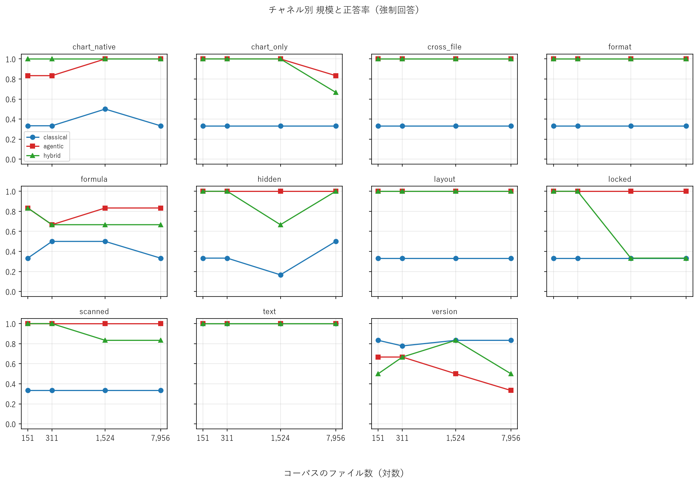

# スケーリング（P4）

強制回答モードのみ。各点の反復回数 N は `n_repeats` 列を参照（P4 で測った点は N=1。SPEC §14-9）。

## 図

## 規模 × アーム

|   n_files | arm       |   n |   accuracy |   cost_usd |   latency_s |   tool_calls |   errors |   acc_min |   acc_max |   n_repeats |   penalized |
|----------:|:----------|----:|-----------:|-----------:|------------:|-------------:|---------:|----------:|----------:|------------:|------------:|
|       151 | agentic   |  66 |      0.939 |      0.040 |      33.190 |        5.818 |        0 |     0.939 |     0.939 |           1 |       0.879 |
|       151 | classical |  66 |      0.439 |      0.014 |      16.488 |        0.000 |        0 |     0.439 |     0.439 |           1 |      -0.106 |
|       151 | hybrid    |  66 |      0.939 |      0.035 |      37.121 |        5.227 |        0 |     0.939 |     0.939 |           1 |       0.879 |
|       311 | agentic   |  66 |      0.924 |      0.045 |      38.202 |        6.182 |        0 |     0.924 |     0.924 |           1 |       0.848 |
|       311 | classical | 198 |      0.449 |      0.014 |      22.154 |        0.000 |        0 |     0.439 |     0.455 |           3 |      -0.076 |
|       311 | hybrid    |  66 |      0.939 |      0.042 |      33.733 |        6.152 |        0 |     0.939 |     0.939 |           1 |       0.879 |
|      1524 | agentic   |  66 |      0.939 |      0.039 |      31.020 |        5.318 |        0 |     0.939 |     0.939 |           1 |       0.879 |
|      1524 | classical |  66 |      0.455 |      0.014 |      15.264 |        0.000 |        0 |     0.455 |     0.455 |           1 |      -0.045 |
|      1524 | hybrid    |  66 |      0.848 |      0.080 |      62.768 |        7.788 |        0 |     0.848 |     0.848 |           1 |       0.697 |
|      7956 | agentic   |  66 |      0.909 |      0.044 |      38.264 |        5.636 |        0 |     0.909 |     0.909 |           1 |       0.818 |
|      7956 | classical |  66 |      0.455 |      0.014 |      16.081 |        0.000 |        0 |     0.455 |     0.455 |           1 |      -0.045 |
|      7956 | hybrid    |  66 |      0.818 |      0.068 |      52.630 |        7.333 |        1 |     0.818 |     0.818 |           1 |       0.652 |

## Arm C の上限（規模プローブ・LLM 未使用）

候補に正解ファイルが**すべて**入った設問の割合。Arm C は候補の外を見られないので、これが正答率の上限になる。

|   n_files |   ceiling |
|----------:|----------:|
|   151.000 |     1.000 |
|   311.000 |     0.970 |
|  1524.000 |     0.833 |
|  7956.000 |     0.848 |

## 規模 × アーム × チャネル

|   n_files | arm       | channel      |   n |   accuracy |   cost_usd |   latency_s |   tool_calls |   errors |   acc_min |   acc_max |   n_repeats |   penalized |
|----------:|:----------|:-------------|----:|-----------:|-----------:|------------:|-------------:|---------:|----------:|----------:|------------:|------------:|
|       151 | agentic   | chart_native |   6 |      0.833 |      0.112 |      74.566 |       13.500 |        0 |     0.833 |     0.833 |           1 |       0.667 |
|       151 | agentic   | chart_only   |   6 |      1.000 |      0.044 |      43.718 |        7.333 |        0 |     1.000 |     1.000 |           1 |       1.000 |
|       151 | agentic   | cross_file   |   6 |      1.000 |      0.036 |      25.284 |        3.333 |        0 |     1.000 |     1.000 |           1 |       1.000 |
|       151 | agentic   | format       |   6 |      1.000 |      0.021 |      23.544 |        4.333 |        0 |     1.000 |     1.000 |           1 |       1.000 |
|       151 | agentic   | formula      |   6 |      0.833 |      0.044 |      34.237 |        4.000 |        0 |     0.833 |     0.833 |           1 |       0.667 |
|       151 | agentic   | hidden       |   6 |      1.000 |      0.027 |      30.242 |        5.500 |        0 |     1.000 |     1.000 |           1 |       1.000 |
|       151 | agentic   | layout       |   6 |      1.000 |      0.015 |      16.407 |        3.167 |        0 |     1.000 |     1.000 |           1 |       1.000 |
|       151 | agentic   | locked       |   6 |      1.000 |      0.038 |      37.542 |        9.167 |        0 |     1.000 |     1.000 |           1 |       1.000 |
|       151 | agentic   | scanned      |   6 |      1.000 |      0.025 |      23.761 |        4.000 |        0 |     1.000 |     1.000 |           1 |       1.000 |
|       151 | agentic   | text         |   6 |      1.000 |      0.012 |      16.061 |        2.000 |        0 |     1.000 |     1.000 |           1 |       1.000 |
|       151 | agentic   | version      |   6 |      0.667 |      0.067 |      39.730 |        7.667 |        0 |     0.667 |     0.667 |           1 |       0.333 |
|       151 | classical | chart_native |   6 |      0.333 |      0.018 |      20.920 |        0.000 |        0 |     0.333 |     0.333 |           1 |      -0.333 |
|       151 | classical | chart_only   |   6 |      0.333 |      0.011 |      15.851 |        0.000 |        0 |     0.333 |     0.333 |           1 |      -0.167 |
|       151 | classical | cross_file   |   6 |      0.333 |      0.012 |      15.548 |        0.000 |        0 |     0.333 |     0.333 |           1 |      -0.333 |
|       151 | classical | format       |   6 |      0.333 |      0.028 |      19.577 |        0.000 |        0 |     0.333 |     0.333 |           1 |      -0.333 |
|       151 | classical | formula      |   6 |      0.333 |      0.014 |      14.595 |        0.000 |        0 |     0.333 |     0.333 |           1 |      -0.333 |
|       151 | classical | hidden       |   6 |      0.333 |      0.013 |      17.378 |        0.000 |        0 |     0.333 |     0.333 |           1 |      -0.333 |
|       151 | classical | layout       |   6 |      0.333 |      0.016 |      19.328 |        0.000 |        0 |     0.333 |     0.333 |           1 |      -0.333 |
|       151 | classical | locked       |   6 |      0.333 |      0.011 |      14.542 |        0.000 |        0 |     0.333 |     0.333 |           1 |      -0.333 |
|       151 | classical | scanned      |   6 |      0.333 |      0.011 |      13.303 |        0.000 |        0 |     0.333 |     0.333 |           1 |      -0.333 |
|       151 | classical | text         |   6 |      1.000 |      0.008 |      12.520 |        0.000 |        0 |     1.000 |     1.000 |           1 |       1.000 |
|       151 | classical | version      |   6 |      0.833 |      0.013 |      17.810 |        0.000 |        0 |     0.833 |     0.833 |           1 |       0.667 |
|       151 | hybrid    | chart_native |   6 |      1.000 |      0.094 |      81.290 |       11.333 |        0 |     1.000 |     1.000 |           1 |       1.000 |
|       151 | hybrid    | chart_only   |   6 |      1.000 |      0.064 |      68.312 |       11.000 |        0 |     1.000 |     1.000 |           1 |       1.000 |
|       151 | hybrid    | cross_file   |   6 |      1.000 |      0.031 |      30.443 |        3.000 |        0 |     1.000 |     1.000 |           1 |       1.000 |
|       151 | hybrid    | format       |   6 |      1.000 |      0.019 |      28.172 |        3.333 |        0 |     1.000 |     1.000 |           1 |       1.000 |
|       151 | hybrid    | formula      |   6 |      0.833 |      0.045 |      32.717 |        3.500 |        0 |     0.833 |     0.833 |           1 |       0.667 |
|       151 | hybrid    | hidden       |   6 |      1.000 |      0.028 |      37.495 |        5.167 |        0 |     1.000 |     1.000 |           1 |       1.000 |
|       151 | hybrid    | layout       |   6 |      1.000 |      0.015 |      20.736 |        3.333 |        0 |     1.000 |     1.000 |           1 |       1.000 |
|       151 | hybrid    | locked       |   6 |      1.000 |      0.026 |      31.916 |        6.500 |        0 |     1.000 |     1.000 |           1 |       1.000 |
|       151 | hybrid    | scanned      |   6 |      1.000 |      0.024 |      27.915 |        3.667 |        0 |     1.000 |     1.000 |           1 |       1.000 |
|       151 | hybrid    | text         |   6 |      1.000 |      0.012 |      20.870 |        2.000 |        0 |     1.000 |     1.000 |           1 |       1.000 |
|       151 | hybrid    | version      |   6 |      0.500 |      0.028 |      28.463 |        4.667 |        0 |     0.500 |     0.500 |           1 |       0.000 |
|       311 | agentic   | chart_native |   6 |      0.833 |      0.115 |     101.953 |       13.333 |        0 |     0.833 |     0.833 |           1 |       0.667 |
|       311 | agentic   | chart_only   |   6 |      1.000 |      0.066 |      71.674 |        9.333 |        0 |     1.000 |     1.000 |           1 |       1.000 |
|       311 | agentic   | cross_file   |   6 |      1.000 |      0.033 |      26.309 |        3.167 |        0 |     1.000 |     1.000 |           1 |       1.000 |
|       311 | agentic   | format       |   6 |      1.000 |      0.021 |      23.210 |        3.833 |        0 |     1.000 |     1.000 |           1 |       1.000 |
|       311 | agentic   | formula      |   6 |      0.667 |      0.038 |      24.280 |        3.333 |        0 |     0.667 |     0.667 |           1 |       0.333 |
|       311 | agentic   | hidden       |   6 |      1.000 |      0.045 |      36.754 |        7.667 |        0 |     1.000 |     1.000 |           1 |       1.000 |
|       311 | agentic   | layout       |   6 |      1.000 |      0.015 |      18.786 |        3.333 |        0 |     1.000 |     1.000 |           1 |       1.000 |
|       311 | agentic   | locked       |   6 |      1.000 |      0.031 |      31.040 |        7.167 |        0 |     1.000 |     1.000 |           1 |       1.000 |
|       311 | agentic   | scanned      |   6 |      1.000 |      0.025 |      23.571 |        4.000 |        0 |     1.000 |     1.000 |           1 |       1.000 |
|       311 | agentic   | text         |   6 |      1.000 |      0.012 |      17.662 |        2.000 |        0 |     1.000 |     1.000 |           1 |       1.000 |
|       311 | agentic   | version      |   6 |      0.667 |      0.088 |      44.983 |       10.833 |        0 |     0.667 |     0.667 |           1 |       0.333 |
|       311 | classical | chart_native |  18 |      0.333 |      0.014 |      26.461 |        0.000 |        0 |     0.333 |     0.333 |           3 |      -0.333 |
|       311 | classical | chart_only   |  18 |      0.333 |      0.012 |      18.105 |        0.000 |        0 |     0.333 |     0.333 |           3 |      -0.333 |
|       311 | classical | cross_file   |  18 |      0.333 |      0.011 |      16.174 |        0.000 |        0 |     0.333 |     0.333 |           3 |      -0.333 |
|       311 | classical | format       |  18 |      0.333 |      0.025 |      26.321 |        0.000 |        0 |     0.333 |     0.333 |           3 |      -0.333 |
|       311 | classical | formula      |  18 |      0.500 |      0.018 |      21.175 |        0.000 |        0 |     0.500 |     0.500 |           3 |       0.000 |
|       311 | classical | hidden       |  18 |      0.333 |      0.015 |      20.861 |        0.000 |        0 |     0.333 |     0.333 |           3 |      -0.278 |
|       311 | classical | layout       |  18 |      0.333 |      0.024 |      36.549 |        0.000 |        0 |     0.333 |     0.333 |           3 |      -0.278 |
|       311 | classical | locked       |  18 |      0.333 |      0.010 |      17.318 |        0.000 |        0 |     0.333 |     0.333 |           3 |      -0.278 |
|       311 | classical | scanned      |  18 |      0.333 |      0.011 |      15.865 |        0.000 |        0 |     0.333 |     0.333 |           3 |      -0.278 |
|       311 | classical | text         |  18 |      1.000 |      0.006 |      12.639 |        0.000 |        0 |     1.000 |     1.000 |           3 |       1.000 |
|       311 | classical | version      |  18 |      0.778 |      0.013 |      32.231 |        0.000 |        0 |     0.667 |     0.833 |           3 |       0.611 |
|       311 | hybrid    | chart_native |   6 |      1.000 |      0.119 |      82.011 |       13.167 |        0 |     1.000 |     1.000 |           1 |       1.000 |
|       311 | hybrid    | chart_only   |   6 |      1.000 |      0.085 |      61.375 |       12.500 |        0 |     1.000 |     1.000 |           1 |       1.000 |
|       311 | hybrid    | cross_file   |   6 |      1.000 |      0.031 |      23.444 |        2.833 |        0 |     1.000 |     1.000 |           1 |       1.000 |
|       311 | hybrid    | format       |   6 |      1.000 |      0.021 |      23.007 |        4.000 |        0 |     1.000 |     1.000 |           1 |       1.000 |
|       311 | hybrid    | formula      |   6 |      0.667 |      0.038 |      22.651 |        3.333 |        0 |     0.667 |     0.667 |           1 |       0.333 |
|       311 | hybrid    | hidden       |   6 |      1.000 |      0.032 |      31.502 |        6.167 |        0 |     1.000 |     1.000 |           1 |       1.000 |
|       311 | hybrid    | layout       |   6 |      1.000 |      0.015 |      17.522 |        3.333 |        0 |     1.000 |     1.000 |           1 |       1.000 |
|       311 | hybrid    | locked       |   6 |      1.000 |      0.039 |      34.073 |        9.333 |        0 |     1.000 |     1.000 |           1 |       1.000 |
|       311 | hybrid    | scanned      |   6 |      1.000 |      0.025 |      23.114 |        4.000 |        0 |     1.000 |     1.000 |           1 |       1.000 |
|       311 | hybrid    | text         |   6 |      1.000 |      0.012 |      17.097 |        2.000 |        0 |     1.000 |     1.000 |           1 |       1.000 |
|       311 | hybrid    | version      |   6 |      0.667 |      0.045 |      35.267 |        7.000 |        0 |     0.667 |     0.667 |           1 |       0.333 |
|      1524 | agentic   | chart_native |   6 |      1.000 |      0.137 |      84.328 |       12.667 |        0 |     1.000 |     1.000 |           1 |       1.000 |
|      1524 | agentic   | chart_only   |   6 |      1.000 |      0.044 |      41.164 |        7.667 |        0 |     1.000 |     1.000 |           1 |       1.000 |
|      1524 | agentic   | cross_file   |   6 |      1.000 |      0.032 |      26.510 |        5.333 |        0 |     1.000 |     1.000 |           1 |       1.000 |
|      1524 | agentic   | format       |   6 |      1.000 |      0.020 |      24.182 |        3.667 |        0 |     1.000 |     1.000 |           1 |       1.000 |
|      1524 | agentic   | formula      |   6 |      0.833 |      0.049 |      23.849 |        3.167 |        0 |     0.833 |     0.833 |           1 |       0.667 |
|      1524 | agentic   | hidden       |   6 |      1.000 |      0.028 |      29.295 |        5.167 |        0 |     1.000 |     1.000 |           1 |       1.000 |
|      1524 | agentic   | layout       |   6 |      1.000 |      0.015 |      17.735 |        3.333 |        0 |     1.000 |     1.000 |           1 |       1.000 |
|      1524 | agentic   | locked       |   6 |      1.000 |      0.031 |      31.188 |        6.833 |        0 |     1.000 |     1.000 |           1 |       1.000 |
|      1524 | agentic   | scanned      |   6 |      1.000 |      0.024 |      21.475 |        3.833 |        0 |     1.000 |     1.000 |           1 |       1.000 |
|      1524 | agentic   | text         |   6 |      1.000 |      0.012 |      15.537 |        2.000 |        0 |     1.000 |     1.000 |           1 |       1.000 |
|      1524 | agentic   | version      |   6 |      0.500 |      0.041 |      25.953 |        4.833 |        0 |     0.500 |     0.500 |           1 |       0.000 |
|      1524 | classical | chart_native |   6 |      0.500 |      0.012 |      14.493 |        0.000 |        0 |     0.500 |     0.500 |           1 |       0.000 |
|      1524 | classical | chart_only   |   6 |      0.333 |      0.013 |      16.094 |        0.000 |        0 |     0.333 |     0.333 |           1 |      -0.333 |
|      1524 | classical | cross_file   |   6 |      0.333 |      0.012 |      13.548 |        0.000 |        0 |     0.333 |     0.333 |           1 |      -0.333 |
|      1524 | classical | format       |   6 |      0.333 |      0.030 |      17.362 |        0.000 |        0 |     0.333 |     0.333 |           1 |      -0.333 |
|      1524 | classical | formula      |   6 |      0.500 |      0.018 |      17.325 |        0.000 |        0 |     0.500 |     0.500 |           1 |       0.167 |
|      1524 | classical | hidden       |   6 |      0.167 |      0.011 |      14.231 |        0.000 |        0 |     0.167 |     0.167 |           1 |      -0.500 |
|      1524 | classical | layout       |   6 |      0.333 |      0.017 |      18.155 |        0.000 |        0 |     0.333 |     0.333 |           1 |      -0.167 |
|      1524 | classical | locked       |   6 |      0.333 |      0.009 |      12.125 |        0.000 |        0 |     0.333 |     0.333 |           1 |      -0.333 |
|      1524 | classical | scanned      |   6 |      0.333 |      0.011 |      14.241 |        0.000 |        0 |     0.333 |     0.333 |           1 |      -0.333 |
|      1524 | classical | text         |   6 |      1.000 |      0.008 |      12.142 |        0.000 |        0 |     1.000 |     1.000 |           1 |       1.000 |
|      1524 | classical | version      |   6 |      0.833 |      0.013 |      18.191 |        0.000 |        0 |     0.833 |     0.833 |           1 |       0.667 |
|      1524 | hybrid    | chart_native |   6 |      1.000 |      0.088 |      76.999 |       10.833 |        0 |     1.000 |     1.000 |           1 |       1.000 |
|      1524 | hybrid    | chart_only   |   6 |      1.000 |      0.046 |      52.304 |        8.500 |        0 |     1.000 |     1.000 |           1 |       1.000 |
|      1524 | hybrid    | cross_file   |   6 |      1.000 |      0.033 |      29.902 |        3.167 |        0 |     1.000 |     1.000 |           1 |       1.000 |
|      1524 | hybrid    | format       |   6 |      1.000 |      0.022 |      28.745 |        4.000 |        0 |     1.000 |     1.000 |           1 |       1.000 |
|      1524 | hybrid    | formula      |   6 |      0.667 |      0.038 |      26.466 |        3.333 |        0 |     0.667 |     0.667 |           1 |       0.333 |
|      1524 | hybrid    | hidden       |   6 |      0.667 |      0.100 |      85.113 |       11.333 |        0 |     0.667 |     0.667 |           1 |       0.333 |
|      1524 | hybrid    | layout       |   6 |      1.000 |      0.015 |      19.135 |        3.167 |        0 |     1.000 |     1.000 |           1 |       1.000 |
|      1524 | hybrid    | locked       |   6 |      0.333 |      0.445 |     289.761 |       27.333 |        0 |     0.333 |     0.333 |           1 |      -0.333 |
|      1524 | hybrid    | scanned      |   6 |      0.833 |      0.035 |      28.531 |        5.000 |        0 |     0.833 |     0.833 |           1 |       0.667 |
|      1524 | hybrid    | text         |   6 |      1.000 |      0.012 |      17.108 |        2.000 |        0 |     1.000 |     1.000 |           1 |       1.000 |
|      1524 | hybrid    | version      |   6 |      0.833 |      0.048 |      36.379 |        7.000 |        0 |     0.833 |     0.833 |           1 |       0.667 |
|      7956 | agentic   | chart_native |   6 |      1.000 |      0.140 |      81.177 |       13.167 |        0 |     1.000 |     1.000 |           1 |       1.000 |
|      7956 | agentic   | chart_only   |   6 |      0.833 |      0.067 |      62.173 |       10.333 |        0 |     0.833 |     0.833 |           1 |       0.667 |
|      7956 | agentic   | cross_file   |   6 |      1.000 |      0.037 |      34.899 |        4.500 |        0 |     1.000 |     1.000 |           1 |       1.000 |
|      7956 | agentic   | format       |   6 |      1.000 |      0.020 |      31.380 |        3.500 |        0 |     1.000 |     1.000 |           1 |       1.000 |
|      7956 | agentic   | formula      |   6 |      0.833 |      0.040 |      29.355 |        3.333 |        0 |     0.833 |     0.833 |           1 |       0.667 |
|      7956 | agentic   | hidden       |   6 |      1.000 |      0.026 |      32.908 |        4.500 |        0 |     1.000 |     1.000 |           1 |       1.000 |
|      7956 | agentic   | layout       |   6 |      1.000 |      0.015 |      22.145 |        3.000 |        0 |     1.000 |     1.000 |           1 |       1.000 |
|      7956 | agentic   | locked       |   6 |      1.000 |      0.040 |      44.375 |        8.667 |        0 |     1.000 |     1.000 |           1 |       1.000 |
|      7956 | agentic   | scanned      |   6 |      1.000 |      0.024 |      26.529 |        3.667 |        0 |     1.000 |     1.000 |           1 |       1.000 |
|      7956 | agentic   | text         |   6 |      1.000 |      0.012 |      21.065 |        2.000 |        0 |     1.000 |     1.000 |           1 |       1.000 |
|      7956 | agentic   | version      |   6 |      0.333 |      0.064 |      34.896 |        5.333 |        0 |     0.333 |     0.333 |           1 |      -0.333 |
|      7956 | classical | chart_native |   6 |      0.333 |      0.012 |      18.105 |        0.000 |        0 |     0.333 |     0.333 |           1 |      -0.333 |
|      7956 | classical | chart_only   |   6 |      0.333 |      0.013 |      18.299 |        0.000 |        0 |     0.333 |     0.333 |           1 |      -0.167 |
|      7956 | classical | cross_file   |   6 |      0.333 |      0.012 |      14.890 |        0.000 |        0 |     0.333 |     0.333 |           1 |      -0.333 |
|      7956 | classical | format       |   6 |      0.333 |      0.029 |      18.646 |        0.000 |        0 |     0.333 |     0.333 |           1 |      -0.333 |
|      7956 | classical | formula      |   6 |      0.333 |      0.015 |      16.179 |        0.000 |        0 |     0.333 |     0.333 |           1 |      -0.333 |
|      7956 | classical | hidden       |   6 |      0.500 |      0.011 |      15.629 |        0.000 |        0 |     0.500 |     0.500 |           1 |       0.000 |
|      7956 | classical | layout       |   6 |      0.333 |      0.015 |      17.390 |        0.000 |        0 |     0.333 |     0.333 |           1 |       0.000 |
|      7956 | classical | locked       |   6 |      0.333 |      0.010 |      13.716 |        0.000 |        0 |     0.333 |     0.333 |           1 |      -0.333 |
|      7956 | classical | scanned      |   6 |      0.333 |      0.010 |      13.264 |        0.000 |        0 |     0.333 |     0.333 |           1 |      -0.333 |
|      7956 | classical | text         |   6 |      1.000 |      0.008 |      12.432 |        0.000 |        0 |     1.000 |     1.000 |           1 |       1.000 |
|      7956 | classical | version      |   6 |      0.833 |      0.013 |      18.342 |        0.000 |        0 |     0.833 |     0.833 |           1 |       0.667 |
|      7956 | hybrid    | chart_native |   6 |      1.000 |      0.128 |      83.116 |       14.500 |        0 |     1.000 |     1.000 |           1 |       1.000 |
|      7956 | hybrid    | chart_only   |   6 |      0.667 |      0.135 |      90.887 |       13.833 |        0 |     0.667 |     0.667 |           1 |       0.333 |
|      7956 | hybrid    | cross_file   |   6 |      1.000 |      0.040 |      46.607 |        4.000 |        0 |     1.000 |     1.000 |           1 |       1.000 |
|      7956 | hybrid    | format       |   6 |      1.000 |      0.018 |      24.272 |        3.000 |        0 |     1.000 |     1.000 |           1 |       1.000 |
|      7956 | hybrid    | formula      |   6 |      0.667 |      0.036 |      23.667 |        3.000 |        0 |     0.667 |     0.667 |           1 |       0.333 |
|      7956 | hybrid    | hidden       |   6 |      1.000 |      0.037 |      39.886 |        7.000 |        0 |     1.000 |     1.000 |           1 |       1.000 |
|      7956 | hybrid    | layout       |   6 |      1.000 |      0.015 |      18.756 |        3.333 |        0 |     1.000 |     1.000 |           1 |       1.000 |
|      7956 | hybrid    | locked       |   6 |      0.333 |      0.252 |     169.068 |       19.333 |        1 |     0.333 |     0.333 |           1 |      -0.167 |
|      7956 | hybrid    | scanned      |   6 |      0.833 |      0.024 |      23.446 |        3.833 |        0 |     0.833 |     0.833 |           1 |       0.667 |
|      7956 | hybrid    | text         |   6 |      1.000 |      0.012 |      19.195 |        2.000 |        0 |     1.000 |     1.000 |           1 |       1.000 |
|      7956 | hybrid    | version      |   6 |      0.500 |      0.053 |      40.030 |        6.833 |        0 |     0.500 |     0.500 |           1 |       0.000 |

## 束ねた run についての注記

- p1-seed42-ja-k8: コーパスは 308 ファイル（311 の点に含めた）
- 311 ファイル: classical/version/forced は p1-seed42-ja-k8 を p1-version-v2-k8 で上書き
